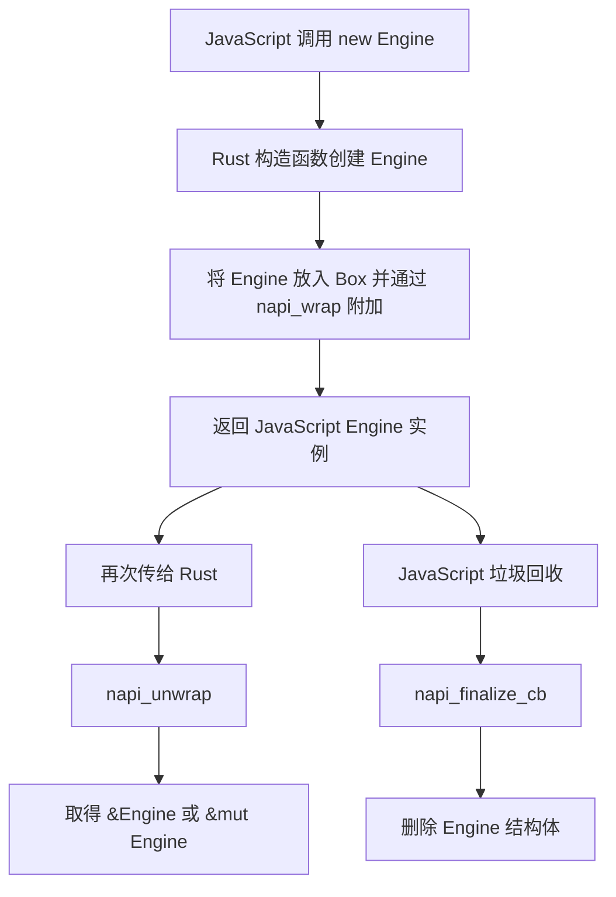
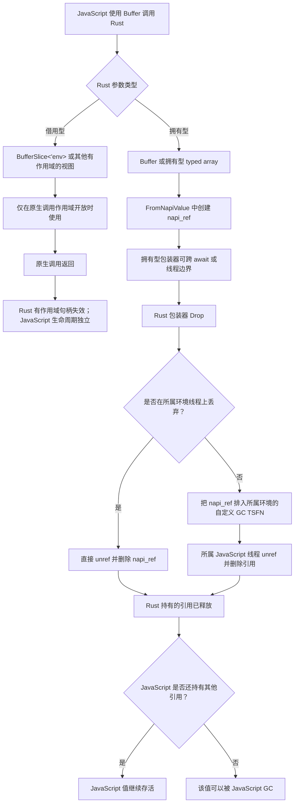

import { Callout } from 'nextra-theme-docs'

import NodeLink from '../../../components/node-link'

# 理解生命周期

`Rust` 生命周期系统与 `JavaScript` 内存管理之间的互操作并不简单。大多数情况下，你不能在 Rust 函数结束后继续使用传入的 JavaScript 值。不过，<NodeLink href="https://nodejs.org/api/n-api.html#references-to-values-with-a-lifespan-longer-than-that-of-the-native-method">Node-API 提供了一组 API</NodeLink>，可以延长 `JavaScript` 值的生命周期。**NAPI-RS** 使用这些 API，尽可能让 `JavaScript` 值的生命周期与 `Rust` 生命周期系统保持一致。

在一次 Node-API 函数调用中，JavaScript 值指针只在函数调用结束前有效，参见<NodeLink href="https://nodejs.org/api/n-api.html#object-lifetime-management">对象生命周期管理</NodeLink>。

> 调用 Node-API 时，底层虚拟机堆中对象的句柄可能以 napi_value 形式返回。这些句柄必须让对象保持“存活”，直到原生代码不再需要它们；否则，在原生代码使用完之前对象就可能被回收。<br/><br/>
> 返回的对象句柄会与一个“scope”关联。默认 scope 的生命周期与原生方法调用的生命周期绑定。因此，默认情况下，句柄在原生方法调用期间始终有效，并且对应对象也会保持存活。

## 原始值的拥有型转换

当 JavaScript 原始值被接收为 `bool`、Rust 整数或浮点数、`String`
等拥有所有权的 Rust 值时，NAPI-RS 会把值复制到 Rust 拥有的数据中。
这些 Rust 数据不受 Node-API 句柄作用域约束。这与接收
`JsString<'env>`、`JsNumber<'env>` 等句柄包装器不同。

## `JsValue` 的生命周期

`JsNumber<'env>`、`JsString<'env>` 等句柄包装器引用当前环境句柄作用域
中的 `napi_value`。你可以从中读取拥有所有权的 Rust 值——例如把
`JsNumber` 读取为 `f64` 或 `u32`——但包装器本身仍受作用域约束。

```rust filename="lib.rs"
use napi::{bindgen_prelude::{Either, Result}, JsNumber};
use napi_derive::napi;

#[napi]
pub fn read_number(a: JsNumber) -> Result<Either<f64, u32>> {
  let input_u32 = a.get_uint32()?;
  let input_f64 = a.get_double()?;
  if input_u32 as f64 == input_f64 {
    Ok(Either::B(input_u32))
  } else {
    Ok(Either::A(input_f64))
  }
}
```

本例返回的数字是拥有所有权的 Rust 值，`JsNumber` 句柄则不是：它的
生命周期会阻止你在原生调用的作用域关闭后继续使用它。字符串也有同样的
区别：`String` 包含一份副本，而 `JsString<'env>` 是有作用域的
JavaScript 句柄。大多数函数签名中，Rust 会自动推断这个作用域生命周期。

## 类实例的生命周期

对于 `#[napi]` 类，实例由 Rust 侧创建，并把所有权交给 JavaScript 侧：

```rust filename="lib.rs"
use std::sync::Arc;

use napi_derive::napi;

#[napi]
pub struct Engine {
  inner: Arc<()>,
}

#[napi]
impl Engine {
  #[napi(constructor)]
  pub fn new() -> Self {
    Self { inner: Arc::new(()) }
  }
}
```

```ts filename="index.ts"
const engine = new Engine()
```

这里，`Engine` 实例在构造函数中创建并返回给 JavaScript。

与 `JsNumber` 或 `JsString` 不同，`Engine` 底层持有 Rust 结构体，因此当 JavaScript 侧把它传回时，可以直接获得 `&Engine` 或 `&mut Engine`。

### 类实例生命周期流程图

下图展示 NAPI-RS 结构体实例的生命周期：



## `Buffer` 和 `TypedArray` 的生命周期

`Buffer` 和具体的拥有型 typed array 类型（`Uint8Array`、`Int32Array`
等）可以活过一次原生调用。只要 Rust 仍持有包装器，它们就会让底层存储
保持存活。`BufferSlice<'env>`、各 typed array slice 类型以及
`TypedArray<'env>` 则借用当前环境作用域中的句柄。

NAPI-RS 提供两类生命周期特性不同的 buffer 类型：

### 拥有所有权的类型——跨线程生命周期

对于源自 JavaScript 的值，转换为拥有所有权的 `Buffer`、`Uint8Array`
等类型时会创建一个 <NodeLink href="https://nodejs.org/api/n-api.html#napi_create_reference">`napi_ref`</NodeLink>：

- 该引用会让 JavaScript 对象及其底层数据一直存活到 Rust 包装器被丢弃
- 包装器可以跨异步边界和线程移动
- 丢弃包装器会释放 Rust 持有的引用；JavaScript 仍可能独立保留同一个对象

```rust filename="lib.rs"
use napi::bindgen_prelude::*;
use napi_derive::napi;

#[napi]
pub fn print_buffer(buffer: Buffer) {
  // 在这个同步回调仍掌握控制权时，创建一份由 Rust 拥有的副本。
  let data = buffer.to_vec();
  std::thread::spawn(move || {
    println!("data: {:?}", data);
  });
}
```

<Callout type="warning">
  `Send` 和 `Sync` 允许移动包装器，但不会同步对字节的访问。Rust 持有
  包装器时，JavaScript 仍可保留并修改同一块底层存储。如果 JavaScript
  或另一个 Rust 线程可能修改该内存，Rust 工作线程同时读写它就会形成
  数据竞争，并可能导致未定义行为。请在分派工作前复制数据，或者实施一个
  能排除所有未同步访问的所有权协议。
</Callout>

<Callout type="info">
  清理由 Rust 包装器的 `Drop` 触发，而不是由 JavaScript GC 触发。启用
  `napi4` 特性时，每个 Node-API 环境/isolate 都有自己的、已经 unref 的
  自定义 GC `ThreadsafeFunction`。如果包装器在所属 JavaScript 线程上
  被丢弃，NAPI-RS 会直接调用
  <NodeLink href="https://nodejs.org/api/n-api.html#napi_reference_unref">`napi_reference_unref`</NodeLink>
  和
  <NodeLink href="https://nodejs.org/api/n-api.html#napi_delete_reference">`napi_delete_reference`</NodeLink>。
  如果在其他线程被丢弃，则会把 `napi_ref` 发送到从该值所属环境捕获的
  `ThreadsafeFunction`，由其回调在所属 JavaScript 线程上释放引用。
  如果所属环境已经关闭，NAPI-RS 会检测到 handle 已中止，不再发起
  Node-API 调用，因为运行时已经使该引用失效。

  释放 Rust 的引用后，只有在 JavaScript 也不再持有其他引用时，该值才
  有资格被 GC。对于 Rust 创建的 buffer，导出前其分配由 Rust 持有；
  导出后由 JavaScript finalizer 持有（若运行时拒绝 external buffer，
  NAPI-RS 会改为复制数据）。

</Callout>

### 借用类型——函数作用域生命周期

借用类型（`BufferSlice<'env>`、`Uint8ArraySlice<'env>` 等）的生命周期绑定到函数作用域：

- 零拷贝访问底层数据
- 受生命周期约束，不能跨越异步边界
- 必须在创建它们的同一次函数调用中使用

```rust filename="lib.rs"
use napi::bindgen_prelude::*;
use napi_derive::napi;

#[napi]
pub fn process_buffer_slice<'env>(env: &'env Env, data: &'env [u8]) -> Result<BufferSlice<'env>> {
  // BufferSlice lifetime is bound to this function scope
  BufferSlice::from_data(env, data.to_vec())
}
```

### Buffer 生命周期流程图



### 生命周期何时会影响代码

**函数作用域生命周期（`BufferSlice<'env>`）：**

```rust filename="lib.rs"
use napi::bindgen_prelude::*;
use napi_derive::napi;

#[napi]
pub fn sync_only(env: &Env) -> Result<BufferSlice<'_>> {
  // ✅ Works: BufferSlice lifetime tied to function scope
  BufferSlice::from_data(env, vec![1, 2, 3])
}

// ❌ Won't compile: Cannot cross async boundaries
// #[napi]
// async fn async_fail(env: &Env) -> Result<BufferSlice<'_>> {
//     let slice = BufferSlice::from_data(env, vec![1, 2, 3])?;
//     napi::tokio::time::sleep(std::time::Duration::from_millis(100)).await;
//     Ok(slice) // Error: slice doesn't live long enough
// }
```

下面的 sleep 示例要求为 `napi` 依赖启用 `async` 和 `tokio_time` 特性。

**引用支持的生命周期（`Buffer`）：**

```rust filename="lib.rs"
use napi::bindgen_prelude::*;
use napi_derive::napi;

#[napi]
pub async fn async_works(buffer: Buffer) -> Result<Buffer> {
  // ✅ Works: Buffer is Send + Sync
  napi::tokio::time::sleep(std::time::Duration::from_millis(100)).await;
  Ok(buffer)
}
```

有关 Buffer 与 TypedArray 使用模式的更多细节，参见 [TypedArray 文档](/docs/concepts/typed-array)。

## JavaScript 值引用

对于其他值，`ObjectRef`、`UnknownRef`、`SymbolRef`、`FunctionRef` 和
`ExternalRef` 等引用包装器使用 `napi_ref`，让 JavaScript 值可以活过
当前回调。包装器本身没有作用域生命周期，但这并不意味着 JavaScript API
与环境无关，或可以从任意线程安全调用。请使用所属 `Env` 把有作用域的值
借回，并遵守各类型的释放约定：有些包装器会在 `Drop` 时释放，而
`ObjectRef`、`UnknownRef` 和 `SymbolRef` 需要显式调用 `unref(env)`
（或者返回给 JavaScript）。

更多信息参见[引用](/docs/concepts/reference#javascript-value-reference)。
