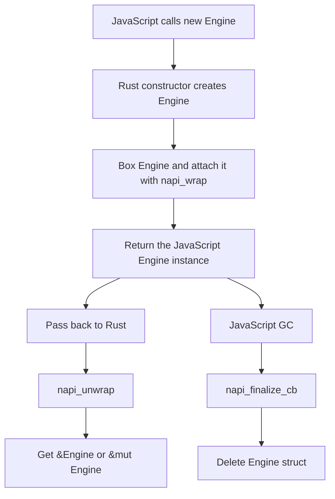
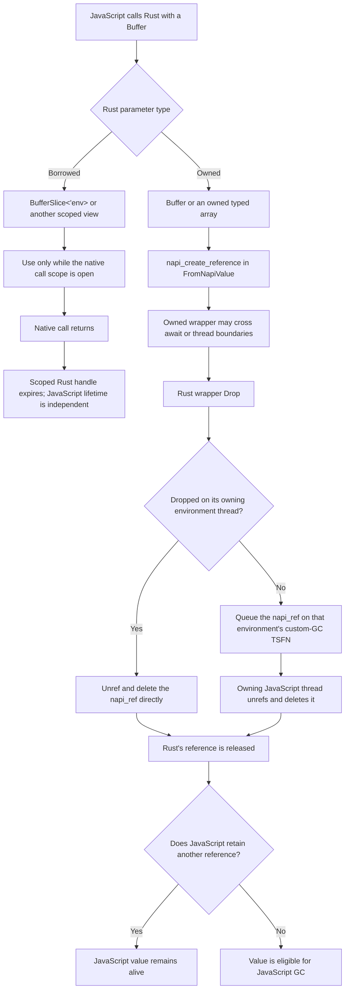

import { Callout } from 'nextra-theme-docs'

import NodeLink from '../../../components/node-link'

# Understanding Lifetime

Interoperability between the `Rust` lifetime system and `JavaScript` memory management is tricky. In most cases, you can't keep using a JavaScript handle after the Rust function returns. However, there are <NodeLink href="https://nodejs.org/api/n-api.html#references-to-values-with-a-lifespan-longer-than-that-of-the-native-method">a bunch of APIs in Node-API</NodeLink> that can extend the lifetime of the `JavaScript` values. **NAPI-RS** uses these APIs to align the lifetime of the `JavaScript` values with the `Rust` lifetime system as much as possible.

During a Node-API function call, JavaScript value handles are normally valid only until the call's handle scope closes; see <NodeLink href="https://nodejs.org/api/n-api.html#object-lifetime-management">Object Lifetime Management</NodeLink>.

> As Node-API calls are made, handles to objects in the heap for the underlying VM may be returned as napi_values. These handles must hold the objects 'live' until they are no longer required by the native code, otherwise the objects could be collected before the native code was finished using them. <br/><br/>
> As object handles are returned they are associated with a 'scope'. The lifespan for the default scope is tied to the lifespan of the native method call. The result is that, by default, handles remain valid and the objects associated with these handles will be held live for the lifespan of the native method call.

## Lifetime of owned primitive conversions

When JavaScript primitives are accepted as owned Rust values such as `bool`, a
Rust integer or float, or `String`, NAPI-RS copies their value into Rust-owned
data. That Rust data is not tied to a Node-API handle scope. This is different
from accepting a handle wrapper such as `JsString<'env>` or `JsNumber<'env>`.

## Lifetime of `JsValue`

Handle wrappers such as `JsNumber<'env>` and `JsString<'env>` refer to a
`napi_value` in the current environment's handle scope. You can read an owned
Rust value from them—for example, a `JsNumber` can be read as `f64` or
`u32`—but the wrapper itself remains scoped.

```rust filename="lib.rs"
use napi::{bindgen_prelude::{Either, Result}, JsNumber};
use napi_derive::napi;

#[napi]
pub fn read_number(a: JsNumber) -> Result<Either<f64, u32>> {
  let input_u32 = a.get_uint32()?;
  let input_f64 = a.get_double()?;
  if input_u32 as f64 == input_f64 {
    Ok(Either::B(input_u32))
  } else {
    Ok(Either::A(input_f64))
  }
}
```

The returned numbers in this example are owned Rust values. The `JsNumber`
handle is not: its lifetime prevents it from being used after the native call's
scope closes. The same distinction applies to strings: `String` contains a
copy, while `JsString<'env>` is a scoped JavaScript handle. In most signatures,
Rust infers the scope lifetime for you.

## Lifetime of class instances

In `#[napi]` class, the instance is created by the Rust side and sent the ownership to the JavaScript side:

```rust filename="lib.rs"
use std::sync::Arc;

use napi_derive::napi;

#[napi]
pub struct Engine {
  inner: Arc<()>,
}

#[napi]
impl Engine {
  #[napi(constructor)]
  pub fn new() -> Self {
    Self { inner: Arc::new(()) }
  }
}
```

```ts filename="index.ts"
const engine = new Engine()
```

In this case, the `Engine` instance is created in the constructor and returned to JavaScript.

Unlike `JsNumber` or `JsString`, the `Engine` holds the Rust struct under the hood, so if it's passed back from the JavaScript side, you can get the `&Engine` or `&mut Engine` directly.

### Class instances Lifetime Flowchart

The following flowchart illustrates the lifetime of a NAPI-RS struct instance lifetime:



## Lifetime of `Buffer` and `TypedArray`

`Buffer` and the concrete owned typed-array types (`Uint8Array`,
`Int32Array`, and so on) can outlive a native call. Their wrappers keep the
backing store alive while Rust holds them. The scoped `BufferSlice<'env>`,
typed-array slice types, and `TypedArray<'env>` instead borrow a handle from the
current environment scope.

NAPI-RS provides two categories of buffer types with different lifetime characteristics:

### Owned Types - Cross-Thread Lifetime

For a JavaScript-origin value, converting to an owned `Buffer`, `Uint8Array`,
and similar type creates a <NodeLink href="https://nodejs.org/api/n-api.html#napi_create_reference">`napi_ref`</NodeLink>:

- The reference keeps the JavaScript object and its backing data alive until
  the Rust wrapper is dropped
- The wrapper can be moved across async boundaries and threads
- Dropping the wrapper releases Rust's reference; JavaScript may still retain
  the same object independently

```rust filename="lib.rs"
use napi::bindgen_prelude::*;
use napi_derive::napi;

#[napi]
pub fn print_buffer(buffer: Buffer) {
  // Make a Rust-owned copy while this synchronous callback has control.
  let data = buffer.to_vec();
  std::thread::spawn(move || {
    println!("data: {:?}", data);
  });
}
```

<Callout type="warning">
  `Send` and `Sync` make it possible to move the wrapper; they do not
  synchronize access to the bytes. JavaScript can retain and mutate the same
  backing store while Rust holds it. Reading or writing that memory on a Rust
  worker while JavaScript or another Rust thread can mutate it is a data race
  and can cause undefined behavior. Copy the data before dispatching work, or
  enforce an ownership protocol that rules out all unsynchronized access.
</Callout>

<Callout type="info">
  Cleanup is tied to the Rust wrapper's `Drop`, not to JavaScript GC. With the
  `napi4` feature, each Node-API environment/isolate has its own unreferenced
  custom-GC `ThreadsafeFunction`. A wrapper dropped on its owning JavaScript
  thread calls
  <NodeLink href="https://nodejs.org/api/n-api.html#napi_reference_unref">`napi_reference_unref`</NodeLink>
  and
  <NodeLink href="https://nodejs.org/api/n-api.html#napi_delete_reference">`napi_delete_reference`</NodeLink>
  directly. A wrapper dropped elsewhere sends its `napi_ref` to the
  `ThreadsafeFunction` captured from the value's owning environment, whose
  callback releases it on that environment's JavaScript thread.
  If that environment has already shut down, NAPI-RS detects the aborted
  handle and makes no further Node-API call because the runtime has already
  invalidated the reference.

  Releasing the Rust reference only makes the JavaScript value eligible for GC
  if JavaScript holds no other references. For Rust-created buffers, Rust owns
  the allocation until it is exported; then the JavaScript finalizer owns that
  allocation (or NAPI-RS copies it when the runtime rejects external buffers).

</Callout>

### Borrowed Types - Function Scope Lifetime

Borrowed types (`BufferSlice<'env>`, `Uint8ArraySlice<'env>`, etc.) have lifetimes bound to the function scope:

- Zero-copy access to the underlying data
- Cannot cross async boundaries due to lifetime constraints
- Must be used within the same function call where they were created

```rust filename="lib.rs"
use napi::bindgen_prelude::*;
use napi_derive::napi;

#[napi]
pub fn process_buffer_slice<'env>(env: &'env Env, data: &'env [u8]) -> Result<BufferSlice<'env>> {
  // BufferSlice lifetime is bound to this function scope
  BufferSlice::from_data(env, data.to_vec())
}
```

### Buffer Lifetime Flowchart



### When Lifetimes Matter

**Function-scoped lifetime (`BufferSlice<'env>`):**

```rust filename="lib.rs"
use napi::bindgen_prelude::*;
use napi_derive::napi;

#[napi]
pub fn sync_only(env: &Env) -> Result<BufferSlice<'_>> {
  // ✅ Works: BufferSlice lifetime tied to function scope
  BufferSlice::from_data(env, vec![1, 2, 3])
}

// ❌ Won't compile: Cannot cross async boundaries
// #[napi]
// async fn async_fail(env: &Env) -> Result<BufferSlice<'_>> {
//     let slice = BufferSlice::from_data(env, vec![1, 2, 3])?;
//     napi::tokio::time::sleep(std::time::Duration::from_millis(100)).await;
//     Ok(slice) // Error: slice doesn't live long enough
// }
```

The sleep examples require the `async` and `tokio_time` features on the `napi`
dependency.

**Reference-backed lifetime (`Buffer`):**

```rust filename="lib.rs"
use napi::bindgen_prelude::*;
use napi_derive::napi;

#[napi]
pub async fn async_works(buffer: Buffer) -> Result<Buffer> {
  // ✅ Works: Buffer is Send + Sync
  napi::tokio::time::sleep(std::time::Duration::from_millis(100)).await;
  Ok(buffer)
}
```

For more details on Buffer and TypedArray usage patterns, see the [TypedArray documentation](/docs/concepts/typed-array).

## JavaScript Value Reference

For other values, reference wrappers such as `ObjectRef`, `UnknownRef`,
`SymbolRef`, `FunctionRef`, and `ExternalRef` use a `napi_ref` to keep a
JavaScript value alive beyond the current callback. The wrapper itself has no
scope lifetime, but that does not make JavaScript APIs environment-independent
or safe to call from arbitrary threads. Borrow the scoped value back with the
owning `Env`, and follow the type's release contract: some wrappers release on
`Drop`, while `ObjectRef`, `UnknownRef`, and `SymbolRef` require an explicit
`unref(env)` (or must be returned to JavaScript).

See [Reference](/docs/concepts/reference#javascript-value-reference) for more details.
