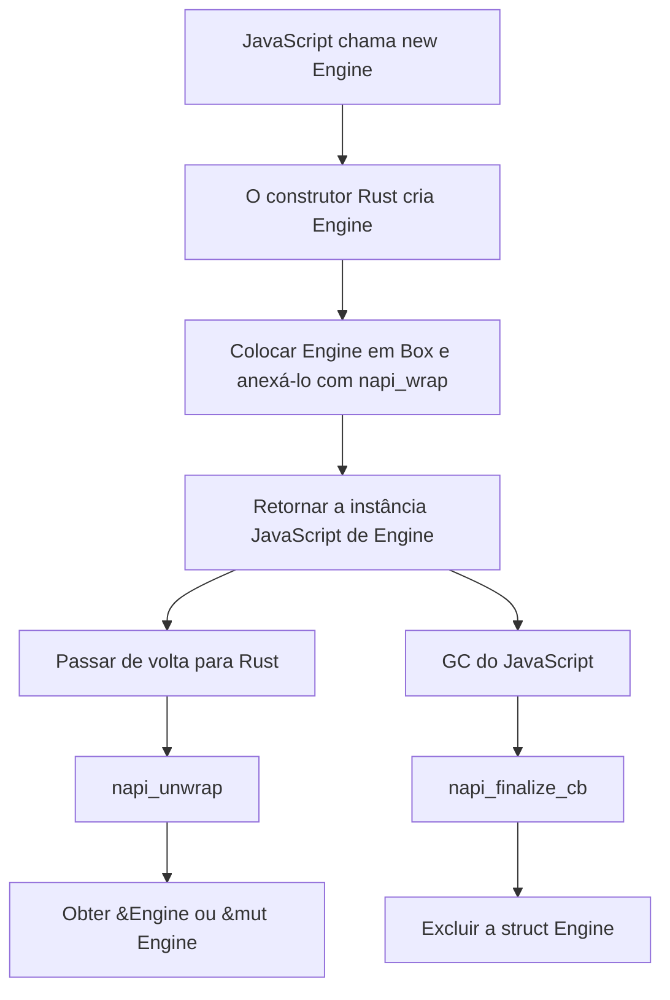
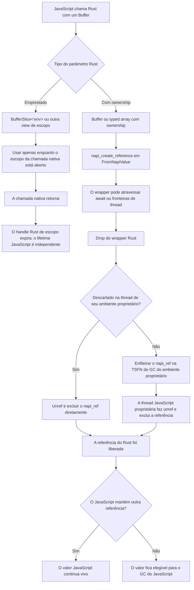

import NodeLink from '../../../components/node-link'

# Entendendo lifetime

A interoperabilidade entre o sistema de lifetime do `Rust` e o gerenciamento de
memória do `JavaScript` é complicada. Na maioria dos casos, você não pode usar
os valores JavaScript passados para a função Rust. No entanto, existem
<NodeLink href="https://nodejs.org/api/n-api.html#references-to-values-with-a-lifespan-longer-than-that-of-the-native-method">várias APIs no Node-API</NodeLink>
que podem estender o lifetime dos valores `JavaScript`. O **NAPI-RS** usa essas
APIs para alinhar o lifetime dos valores `JavaScript` com o sistema de lifetime
do `Rust` tanto quanto possível.

Em uma chamada de função Node-API, os ponteiros para valores JavaScript só são
válidos até o fim da chamada da função; veja
<NodeLink href="https://nodejs.org/api/n-api.html#object-lifetime-management">Object Lifetime Management</NodeLink>.

> À medida que chamadas Node-API são feitas, handles para objetos no heap da VM
> subjacente podem ser retornados como napi_values. Esses handles precisam
> manter os objetos "vivos" enquanto eles ainda forem necessários ao código
> nativo; caso contrário, os objetos podem ser coletados antes que o código
> nativo termine de usá-los. <br/><br/>
> À medida que handles de objeto são retornados, eles são associados a um
> "scope". O lifetime do scope padrão está ligado ao lifetime da chamada do
> método nativo. O resultado é que, por padrão, os handles permanecem válidos e
> os objetos associados a esses handles serão mantidos vivos durante o lifetime
> da chamada do método nativo.

## Conversões primitivas com ownership

Quando primitivas JavaScript são recebidas como valores Rust com ownership,
como `bool`, um inteiro ou ponto flutuante Rust, ou `String`, o NAPI-RS copia o
valor para dados pertencentes ao Rust. Esses dados Rust não ficam vinculados ao
escopo de handles do Node-API. Isso é diferente de receber um wrapper de handle
como `JsString<'env>` ou `JsNumber<'env>`.

## Lifetime de `JsValue`

Wrappers de handle como `JsNumber<'env>` e `JsString<'env>` fazem referência a
um `napi_value` no escopo de handles do ambiente atual. Você pode ler deles um
valor Rust com ownership — por exemplo, ler um `JsNumber` como `f64` ou `u32`
—, mas o wrapper em si continua limitado ao escopo.

```rust filename="lib.rs"
use napi::{bindgen_prelude::{Either, Result}, JsNumber};
use napi_derive::napi;

#[napi]
pub fn read_number(a: JsNumber) -> Result<Either<f64, u32>> {
  let input_u32 = a.get_uint32()?;
  let input_f64 = a.get_double()?;
  if input_u32 as f64 == input_f64 {
    Ok(Either::B(input_u32))
  } else {
    Ok(Either::A(input_f64))
  }
}
```

Os números retornados neste exemplo são valores Rust com ownership. O handle
`JsNumber` não é: seu lifetime impede o uso depois que o escopo da chamada
nativa se fecha. A mesma distinção vale para strings: `String` contém uma
cópia, enquanto `JsString<'env>` é um handle JavaScript limitado ao escopo. Na
maioria das assinaturas, o Rust infere esse lifetime para você.

## Lifetime de instâncias de classe

Em uma classe `#[napi]`, a instância é criada pelo lado Rust e a posse é
enviada para o lado JavaScript:

```rust filename="lib.rs"
use std::sync::Arc;

use napi_derive::napi;

#[napi]
pub struct Engine {
  inner: Arc<()>,
}

#[napi]
impl Engine {
  #[napi(constructor)]
  pub fn new() -> Self {
    Self { inner: Arc::new(()) }
  }
}
```

```ts filename="index.ts"
const engine = new Engine()
```

Nesse caso, a instância `Engine` é criada no construtor e retornada ao
JavaScript.

Diferentemente de `JsNumber` ou `JsString`, `Engine` mantém a struct Rust sob o
capô, então, se ela for passada de volta pelo lado JavaScript, você poderá
obter `&Engine` ou `&mut Engine` diretamente.

### Fluxograma de lifetime de instâncias de classe

O fluxograma a seguir ilustra o lifetime de uma instância de struct do NAPI-RS:



## Lifetime de `Buffer` e `TypedArray`

`Buffer` e os tipos concretos de typed array com ownership (`Uint8Array`,
`Int32Array` e assim por diante) podem sobreviver a uma chamada nativa. Seus
wrappers mantêm o armazenamento subjacente vivo enquanto o Rust os possui. Já
`BufferSlice<'env>`, os tipos slice de typed array e `TypedArray<'env>` tomam
emprestado um handle do escopo do ambiente atual.

O NAPI-RS fornece duas categorias de tipos de buffer com características de
lifetime diferentes:

### Tipos com ownership - lifetime entre threads

Para um valor originado no JavaScript, a conversão para um `Buffer`,
`Uint8Array` ou tipo semelhante com ownership cria um
<NodeLink href="https://nodejs.org/api/n-api.html#napi_create_reference">`napi_ref`</NodeLink>:

- A referência mantém o objeto JavaScript e seus dados subjacentes vivos até o
  wrapper Rust ser descartado
- O wrapper pode atravessar fronteiras assíncronas e entre threads
- Descartar o wrapper libera a referência do Rust; o JavaScript ainda pode
  manter o mesmo objeto de forma independente

```rust filename="lib.rs"
use napi::bindgen_prelude::*;
use napi_derive::napi;

#[napi]
pub fn print_buffer(buffer: Buffer) {
  // Crie uma cópia pertencente ao Rust enquanto este callback síncrono controla a execução.
  let data = buffer.to_vec();
  std::thread::spawn(move || {
    println!("data: {:?}", data);
  });
}
```

<Callout type="warning">
  `Send` e `Sync` permitem mover o wrapper; eles não sincronizam o acesso aos
  bytes. O JavaScript pode manter e modificar o mesmo armazenamento subjacente
  enquanto o Rust segura o wrapper. Ler ou gravar essa memória em uma worker
  Rust enquanto o JavaScript ou outra thread Rust pode modificá-la constitui
  uma corrida de dados e pode causar comportamento indefinido. Copie os dados
  antes de despachar o trabalho ou imponha um protocolo de ownership que
  exclua todo acesso não sincronizado.
</Callout>

<Callout type="info">
  A limpeza está vinculada ao `Drop` do wrapper Rust, não ao GC do JavaScript.
  Com a feature `napi4`, cada ambiente/isolate do Node-API tem sua própria
  `ThreadsafeFunction` de GC customizada e sem referência ao event loop. Um
  wrapper descartado na thread JavaScript de seu ambiente chama
  <NodeLink href="https://nodejs.org/api/n-api.html#napi_reference_unref">`napi_reference_unref`</NodeLink>
  e
  <NodeLink href="https://nodejs.org/api/n-api.html#napi_delete_reference">`napi_delete_reference`</NodeLink>
  diretamente. Se o wrapper for descartado em outro lugar, seu `napi_ref` será
  enviado à `ThreadsafeFunction` capturada do ambiente proprietário do valor,
  cujo callback o libera na thread JavaScript desse ambiente.
  Se esse ambiente já tiver sido encerrado, o NAPI-RS detecta o handle abortado
  e não faz outra chamada Node-API, pois o runtime já invalidou a referência.

  Liberar a referência do Rust só torna o valor elegível para GC se o
  JavaScript não mantiver outras referências. Para buffers criados no Rust, o
  Rust possui a alocação até sua exportação; depois disso, o finalizer do
  JavaScript possui essa alocação (ou o NAPI-RS a copia quando o runtime rejeita
  buffers externos).

</Callout>

### Tipos emprestados - lifetime no escopo da função

Tipos emprestados (`BufferSlice<'env>`, `Uint8ArraySlice<'env>` etc.) têm
lifetimes vinculados ao escopo da função:

- Acesso sem cópia aos dados subjacentes
- Não podem atravessar fronteiras assíncronas devido às restrições de lifetime
- Precisam ser usados dentro da mesma chamada de função em que foram criados

```rust filename="lib.rs"
use napi::bindgen_prelude::*;
use napi_derive::napi;

#[napi]
pub fn process_buffer_slice<'env>(env: &'env Env, data: &'env [u8]) -> Result<BufferSlice<'env>> {
  // O lifetime de BufferSlice está vinculado a este escopo de função
  BufferSlice::from_data(env, data.to_vec())
}
```

### Fluxograma de lifetime de buffer



### Quando lifetimes importam

**Lifetime no escopo da função (`BufferSlice<'env>`):**

```rust filename="lib.rs"
use napi::bindgen_prelude::*;
use napi_derive::napi;

#[napi]
pub fn sync_only(env: &Env) -> Result<BufferSlice<'_>> {
  // ✅ Funciona: o lifetime de BufferSlice está ligado ao escopo da função
  BufferSlice::from_data(env, vec![1, 2, 3])
}

// ❌ Não compila: não pode atravessar fronteiras assíncronas
// #[napi]
// async fn async_fail(env: &Env) -> Result<BufferSlice<'_>> {
//     let slice = BufferSlice::from_data(env, vec![1, 2, 3])?;
//     napi::tokio::time::sleep(std::time::Duration::from_millis(100)).await;
//     Ok(slice) // Erro: slice não vive tempo suficiente
// }
```

Os exemplos com `sleep` abaixo exigem as features `async` e `tokio_time` na
dependência `napi`.

**Lifetime apoiado por referência (`Buffer`):**

```rust filename="lib.rs"
use napi::bindgen_prelude::*;
use napi_derive::napi;

#[napi]
pub async fn async_works(buffer: Buffer) -> Result<Buffer> {
  // ✅ Funciona: Buffer é Send + Sync
  napi::tokio::time::sleep(std::time::Duration::from_millis(100)).await;
  Ok(buffer)
}
```

Para mais detalhes sobre padrões de uso de Buffer e TypedArray, veja a
[documentação de TypedArray](/docs/concepts/typed-array).

## Referência a valores JavaScript

Para outros valores, wrappers de referência como `ObjectRef`, `UnknownRef`,
`SymbolRef`, `FunctionRef` e `ExternalRef` usam um `napi_ref` para manter um
valor JavaScript vivo além do callback atual. O wrapper em si não tem lifetime
de escopo, mas isso não torna as APIs JavaScript independentes do ambiente nem
seguras para chamar de qualquer thread. Recupere o valor com escopo usando o
`Env` proprietário e siga o contrato de liberação do tipo: alguns wrappers
liberam no `Drop`, enquanto `ObjectRef`, `UnknownRef` e `SymbolRef` exigem um
`unref(env)` explícito (ou precisam ser retornados ao JavaScript).

Veja [Reference](/docs/concepts/reference#javascript-value-reference) para mais
detalhes.
