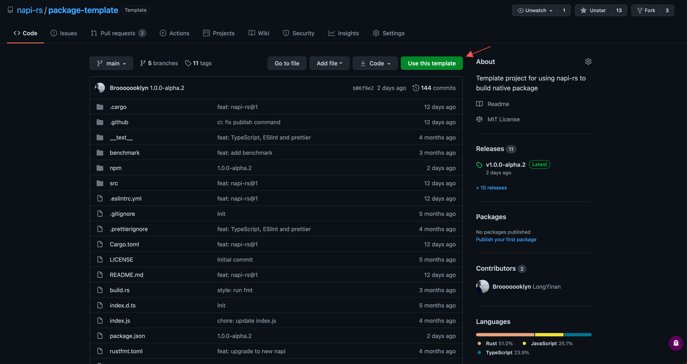

# Primeiros passos

import Video from '../../../public/assets/napi-rs-guide.mp4'

A forma mais rápida de iniciar um pacote napi-rs v3 é com `napi new`. Ele copia
o template de pacote mantido, aplica o nome do seu pacote e a seleção de
targets, e opcionalmente cria um workflow do GitHub Actions.

<video controls style={{ width: '100%' }}>
  <source src={Video} type="video/mp4" />
  <track kind="captions" srcLang="en" />
</video>

## Pré-requisitos {#prerequisites}

- **Recomenda-se Node.js 22.13 ou mais recente na linha Node 22, ou Node.js
  24+**, para o conjunto atual de ferramentas do `@napi-rs/cli`. A CLI declara
  `>=23.5.0 || ^22.13.0 || ^20.17.0`, em conformidade com sua dependência de
  prompts interativos. Esse requisito de build é separado do requisito de
  runtime do addon que você produzir. Consulte [Suporte e
  compatibilidade](/pt-BR/docs/more/support-compatibility#cli-and-rust-requirements).
- **Rust 1.88 ou mais recente**, incluindo Cargo. Recomenda-se instalar o Rust
  com [rustup](https://rustup.rs/).
- **Git**, porque `napi new` baixa e atualiza o template usando Git.
- Um linker funcional para sua plataforma de desenvolvimento: Xcode Command
  Line Tools no macOS, MSVC Build Tools no Windows, ou as ferramentas C
  usuais no Linux.

O Node-API torna um binário nativo ABI-compatível com versões posteriores do
Node.js que forneçam o nível de Node-API contra o qual ele foi compilado. Isso
é diferente das versões de Node e dos target triples exercitados pela CI do
napi-rs. Leia [Suporte e compatibilidade](/pt-BR/docs/more/support-compatibility)
antes de escolher um runtime ou definir a matriz de distribuição.

## Crie um projeto

Você não precisa de uma instalação global da CLI. Execute o pacote diretamente
com o executor de pacotes de sua preferência:

```sh
# Template Yarn (o padrão)
npx @napi-rs/cli new cool

# O mesmo template via Yarn
yarn dlx @napi-rs/cli new cool

# Template pnpm
pnpm dlx @napi-rs/cli new cool --package-manager pnpm
```

O comando é interativo por padrão. Ele pergunta:

1. O nome do pacote gravado em `package.json`.
2. O nível mínimo de Node-API usado na feature Cargo gerada e no requisito de
   engine Node.js do pacote.
3. Os target triples a manter do template selecionado.
4. A licença.
5. Se devem ser geradas declarações TypeScript.
6. Se o workflow do GitHub Actions do template deve ser mantido.

Só os templates mantidos de **Yarn** e **pnpm** são compatíveis. O template
fixa sua própria versão do gerenciador de pacotes, então use os comandos
correspondentes depois que o projeto for criado. Para criar um projeto sem
prompts, passe todos os valores que quiser alterar e adicione
`--no-interactive`; veja [`napi new`](/pt-BR/docs/cli/new).

## Instale, compile e teste

Para o template padrão de Yarn:

```sh
cd cool
yarn install
yarn build
yarn test
```

Para o template pnpm:

```sh
cd cool
pnpm install
pnpm build
pnpm test
```

A build local compila um único target nativo: o do seu host, a menos que você
passe `--target`. Ela produz:

- `<binaryName>.<platform-arch-abi>.node`, o addon nativo.
- `index.js`, o loader gerado.
- `index.d.ts`, as declarações TypeScript geradas quando a geração de tipos
  está habilitada.

Os arquivos-fonte importantes no projeto gerado são:

| Caminho | Finalidade |
| --- | --- |
| `src/lib.rs` | Funções, structs e classes Rust exportadas com `#[napi]` |
| `Cargo.toml` | Metadados do crate Rust e dependências do napi-rs |
| `build.rs` | Configuração de build exigida pelo napi-rs |
| `package.json` | Scripts JavaScript, metadados do pacote e configuração `napi` |
| `.github/workflows/CI.yml` | Workflow de build, teste, artefatos e publicação multi-target |

Os templates não versionam `npm/`. Depois das builds de plataforma, o job de
publicação cria os diretórios de cada target com `napi create-npm-dirs`.

Continue em [Um pacote simples](./simple-package) para editar a API Rust e
chamá-la a partir do Node.js.

## Aprofundamento {#deep-dive}

### Como o pacote gerado é distribuído

O napi-rs normalmente publica um pequeno pacote raiz e um pacote opcional por
plataforma. Por exemplo, `@cool/core` pode depender de:

```json filename="package.json"
{
  "optionalDependencies": {
    "@cool/core-darwin-x64": "1.0.0",
    "@cool/core-win32-x64-msvc": "1.0.0",
    "@cool/core-linux-arm64-gnu": "1.0.0"
  }
}
```

O `index.js` gerado primeiro procura um addon local produzido durante o
desenvolvimento. Em um pacote instalado, ele carrega o pacote opcional
correspondente ao sistema operacional, CPU e libc Linux atuais. O gerenciador
de pacotes usa os campos `os`, `cpu` e, quando aplicável, `libc` do pacote de
plataforma para evitar a instalação de binários incompatíveis.

Recomenda-se usar um [escopo npm](https://docs.npmjs.com/creating-and-publishing-scoped-public-packages/)
porque cada target compatível precisa de um nome de pacote distinto.

O array `napi.targets` define o que o projeto empacota; ele **não** faz com que
uma única execução de `napi build` compile todos os targets. O scaffold só pode
manter jobs de build que já existam em seu template. Para targets aceitos
adicionais, adicione explicitamente a entrada de configuração, o diretório npm
e a build da CI. Veja [Suporte e
compatibilidade](/pt-BR/docs/more/support-compatibility) e [Compilação
cruzada](/pt-BR/docs/cross-build).

#### Problema de suporte ao IDE

Caso sua IDE se recusa a autocompletar/surgerir automaticamente código ao usar o macro `#[napi]`, você pode usar a seguinte configuração para corrigir isso:

Para vscode em `settings.json`:

```json
{
  "rust-analyzer.procMacro.ignored": { "napi-derive": ["napi"] }
}
```

Para Neovim.

```toml
['rust-analyzer'] = {
    procMacro = {
        ignored = {
            ['napi-derive'] = { 'napi' },
        },
    },
},
```

Este problema pode emitir o seguinte erro no Rust Analyzer:

```
[ERROR proc_macro_api::msg] proc-macro tried to print : `napi` macro expand failed.
```

## Comece diretamente de um template



Se você preferir o fluxo **Use this template** do GitHub, escolha o projeto
correspondente:

- [Template de pacote Yarn](https://github.com/napi-rs/package-template)
- [Template de pacote pnpm](https://github.com/napi-rs/package-template-pnpm)

Depois de clonar, instale as dependências e execute `napi rename` pelo
gerenciador de pacotes selecionado antes de publicar com o nome do seu próprio
pacote.

## Próximos passos

- [`napi new`](/pt-BR/docs/cli/new) para todas as opções de scaffold.
- [Build](/pt-BR/docs/cli/build) e [Compilação cruzada](/pt-BR/docs/cross-build) para
  targets adicionais.
- [Publicar pacotes nativos](/pt-BR/docs/deep-dive/release) antes de publicar
  qualquer coisa no npm.
