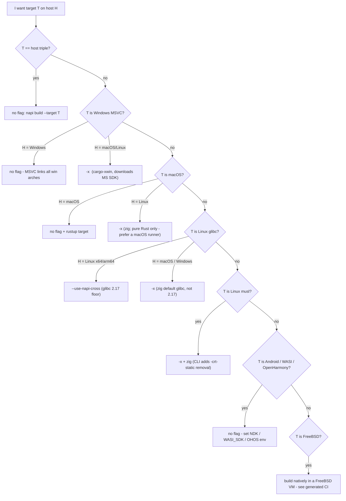

# Plan: Fix cross-compile flag documentation (napi-rs/napi-rs#3355)

Repo: `/Users/brooklyn/workspace/github/website` (source of truth = `content/**/*.mdx`; regen with `scripts/convert-content.mjs`, never hand-edit `pages/` for docs).
All flag behavior below is verified against napi-rs CLI source at commit `21d2f1353df83c0c78f32ba61de44fac46aa2460` (`cli/src/api/build.ts` unless noted). The "warnings lie" / silent-fallback / `CARGO` override claims were additionally re-checked by hand in this session.

Research inputs (session scratchpad, `/private/tmp/claude-501/-Users-brooklyn-workspace-github-website/185a0e81-63b9-4190-b2ea-e3e9386f061d/scratchpad/`): `research-sourceTruth.json`, `research-docsAudit.json`, `research-userPain.json`, `research-ecosystem.json`, `research-ciTemplates.json`.

---

## 1. Facts the docs must convey (this becomes doc copy)

### The one-line mental model

| Flag                     | What it changes                               | Result command                                 |
| ------------------------ | --------------------------------------------- | ---------------------------------------------- |
| _(none)_                 | nothing                                       | `cargo build --target <triple>`                |
| `--use-cross`            | the **binary** only                           | `cross build --target <triple>`                |
| `--cross-compile` / `-x` | the **subcommand** only (+2 env side effects) | `cargo zigbuild ...` or `cargo xwin build ...` |
| `--use-napi-cross`       | **env vars** only (linker/CC/sysroot)         | still `cargo build ...`                        |

(binary: build.ts:302-303; subcommand: build.ts:367-394; env: build.ts:188-287)

### No-flag baseline

- Target pick order: `--target` > `CARGO_BUILD_TARGET` env > host triple from `rustc -vV` (rustc must be on PATH only in the last case). build.ts:111-115, target.ts:173-185.
- `process.env.CARGO` silently replaces the spawned binary in every mode — it even defeats `--use-cross` with no warning. build.ts:302-303.
- Any `*musl*` target: CLI appends `-C target-feature=-crt-static` to RUSTFLAGS (exported env RUSTFLAGS overrides the user's `.cargo/config.toml` rustflags per cargo precedence — pain in #2151). `--strip` appends `-C link-arg=-s`. build.ts:436-448.
- Without `-x`, 5 exotic triples get `CARGO_TARGET_<T>_LINKER` set to a cross-gcc the **user must install** (aarch64-musl→`aarch64-linux-musl-gcc`, loongarch64→`loongarch64-linux-gnu-gcc-13`, riscv64gc→`riscv64-linux-gnu-gcc`, ppc64le→`powerpc64le-linux-gnu-gcc`, s390x→`s390x-linux-gnu-gcc`). Set blindly; missing binary fails at link time. target.ts:47-54, build.ts:456-468.
- Android / WASI / OpenHarmony targets get toolchain env from `ANDROID_NDK_LATEST_HOME` / `WASI_SDK_PATH` (must be set AND exist) / `OHOS_SDK_PATH` — **always, regardless of cross flags**. Android/WASI assignments can even clobber a user-set `CARGO_TARGET_*_LINKER`. build.ts:470-647.
- Artifact copy and JS/dts binding generation are identical in all modes. build.ts:721-818.

### `--cross-compile` / `-x`

- Windows (MSVC) target on a **non-Windows host** → `cargo xwin build` (cargo-xwin auto-installed; it downloads the MS CRT/WinSDK itself — MS license applies; `XWIN_ARCH=x86` auto-set for i686). build.ts:376-380.
- **Every other target** (linux gnu/musl, darwin, android, wasi, even host==target) → `cargo zigbuild` unconditionally; no allowlist, no host==target check. build.ts:383-389.
- Windows target on a Windows host: warned no-op → plain `cargo build`. build.ts:369-372.
- cargo-xwin/cargo-zigbuild are auto-installed via `cargo install` (first run can be slow). **`zig` itself is never installed or checked by the CLI** — cargo-zigbuild finds it or errors. cargo.ts:5-35.
- Suppresses the 5-triple baseline linker table (linking is delegated). build.ts:456-458.
- No glibc-suffix plumbing: `--target aarch64-unknown-linux-gnu.2.17` breaks artifact lookup (raw triple used as dir; zigbuild strips the suffix) — issue #3176. build.ts:762. Without a suffix, zig's own default glibc applies (2.28 for zig 0.12–0.14), **not** 2.17.
- Upstream limits (cargo-zigbuild README): only Linux and macOS _targets_; Apple-framework-linking deps need a real macOS SDK (`SDKROOT`) — #1760, #2249.

### `--use-cross`

- **Status: legacy, not recommended** (maintainer decision, 2026-07-06): the recommended mechanisms are `--use-napi-cross` (Linux glibc targets) and `-x` (everything else). Docker-image-based builds (the `nodejs-rust:*` images / `*.Dockerfile` files in the napi-rs repo) are **deprecated** — docs must say so explicitly (also foreshadowed by the maintainer in #2411: "We will migrate to brand new cross compile toolchain in the next major release").
- Swaps binary to `cross`; args and all host-computed env unchanged. Whether host env reaches the container is cross's passthrough rules, not the CLI's. build.ts:302-309.
- **Not auto-installed** — missing binary = `spawn cross ENOENT`. Needs Docker ≥20.10 or Podman ≥3.4. build.ts:320-322.
- No per-target checks; cross has no publishable macOS or Windows-MSVC images (Apple/MS licensing). Linux-gnu images are mostly glibc 2.31 (`:centos` variants = 2.17).

### `--use-napi-cross`

- Downloads a gcc toolchain from npm (`@napi-rs/cross-toolchain`, via `npm pack`) into `~/.napi-rs/cross-toolchain/<version>/<triple>` (cached; also writes inside the installed package dir, so both must be writable; npm required on PATH). build.ts:211-224.
- Supports **exactly 5 triples**: x86_64 / aarch64 -unknown-linux-gnu, armv7-unknown-linux-gnueabihf, powerpc64le- and s390x-unknown-linux-gnu. The current flag description ("arm/arm64/x64") undercounts. glibc floor 2.17 (manylinux2014 lineage).
- Host must be **Linux x64/arm64**. The CLI never checks platform: on macOS/Windows the download "succeeds" and the ELF gcc fails at link time.
- Sets (only if absent from user env): `CARGO_TARGET_<T>_LINKER`, `TARGET_CC/CXX/AR/RANLIB/READELF`, `TARGET_SYSROOT`, `TARGET_C_INCLUDE_PATH`, `BINDGEN_EXTRA_CLANG_ARGS`, plus PATH prepend; clang hosts also get `TARGET_CFLAGS/CXXFLAGS`. build.ts:225-281. User env always wins for these.
- **Silent fallback**: any failure (unsupported triple, host arch, network) prints one WARNING and continues as plain `cargo build` — the later linker error is unrelated-looking. build.ts:282-285.
- Known recipe for cc-based crates (ring etc.): `TARGET_CC=clang` (#2544). `TARGET_CC` outranks `CC` since cli 3.0.0-alpha.92 (#2766).
- **Old-GCC limitation** (cross-toolchain#4): the bundled aarch64 gcc is too old for `aws-lc-sys` — any project transitively depending on rustls (reqwest/hyper-rustls default) fails to cross-compile aarch64-gnu with this flag. Escape: `TARGET_CC=clang` or a different mechanism. Document as a known limitation.

### Combination rules (document as: "pick exactly one")

| Combo                              | What actually happens                                                                                                                                                        |
| ---------------------------------- | ---------------------------------------------------------------------------------------------------------------------------------------------------------------------------- |
| `--use-cross` + `-x`               | Hard error (after possible slow `cargo install` side effects). build.ts:297-301                                                                                              |
| `--use-napi-cross` + `--use-cross` | Warning says "--use-cross will be ignored" (and misnames it `--cross`) — **false**: `cross` still runs with host-path env injected. Broken; do not combine. build.ts:192-196 |
| `--use-napi-cross` + `-x`          | Warning says "-x will be ignored" — **false**: zigbuild runs with napi-cross gcc env also set (napi-cross linker wins over zig). Do not combine. build.ts:198-202            |
| `--watch` + `-x`                   | Produces invalid `cargo watch ... -- cargo build zigbuild`. Do not combine. build.ts:342-395                                                                                 |

Linker precedence per triple: user `CARGO_TARGET_<T>_LINKER` env > napi-cross gcc > baseline table; `-x` contributes none (exception: android/wasi platform env can clobber user env — see baseline).

Also document (from #1540): **inside the official docker images, run plain `napi build` with NO cross flag** — the image already pins the toolchain/glibc; stacking flags on top is what breaks DIY setups.

---

## 2. Decision matrix (host × target × flag)

Main table — one row per template-supported target:

| Target                                            | Generated CI does (proof it works)                                                  | Linux x64/arm64 host                                                                                     | macOS host                                         | Windows host                                            |
| ------------------------------------------------- | ----------------------------------------------------------------------------------- | -------------------------------------------------------------------------------------------------------- | -------------------------------------------------- | ------------------------------------------------------- |
| x86_64-apple-darwin                               | macos-latest runner, **no flag** (rustup target + `MACOSX_DEPLOYMENT_TARGET=10.13`) | `-x` (zig; pure-Rust only — Apple-framework deps need macOS SDK)                                         | no flag                                            | not supported                                           |
| aarch64-apple-darwin                              | macos-latest, **no flag** (native)                                                  | `-x` (same caveat)                                                                                       | no flag                                            | not supported                                           |
| x86_64-pc-windows-msvc                            | windows-latest, **no flag**                                                         | `-x` (xwin; needs clang; MS SDK license)                                                                 | `-x` (brew llvm)                                   | no flag                                                 |
| i686-pc-windows-msvc                              | windows-latest, **no flag**                                                         | `-x` (XWIN_ARCH auto)                                                                                    | `-x`                                               | no flag                                                 |
| aarch64-pc-windows-msvc                           | windows-latest x64, **no flag** (MSVC cross-links)                                  | `-x`                                                                                                     | `-x`                                               | no flag                                                 |
| x86_64-unknown-linux-gnu                          | ubuntu, **`--use-napi-cross`** (glibc 2.17)                                         | `--use-napi-cross` (no flag = inherits host glibc → "GLIBC_x.yy not found" on older deploy hosts, #2412) | `-x` (napi-cross toolchain is Linux ELF, unusable) | `-x` + zig (zig runs on Windows; legacy: `--use-cross`) |
| aarch64-unknown-linux-gnu                         | ubuntu, **`--use-napi-cross`**                                                      | `--use-napi-cross`                                                                                       | `-x`                                               | `-x` + zig                                              |
| armv7-unknown-linux-gnueabihf                     | ubuntu, **`--use-napi-cross`**                                                      | `--use-napi-cross`                                                                                       | `-x`                                               | `-x` + zig                                              |
| x86_64 / aarch64 -unknown-linux-musl              | ubuntu, **`-x`** + zig 0.14.1 setup step                                            | `-x` + zig                                                                                               | `-x` + zig                                         | `-x` + zig                                              |
| aarch64-linux-android / armv7-linux-androideabi   | ubuntu, **no flag** — CLI reads preinstalled `ANDROID_NDK_LATEST_HOME`              | no flag + NDK env                                                                                        | no flag + NDK env                                  | no flag + NDK env                                       |
| wasm32-wasip1-threads                             | ubuntu, **no flag** (rustup rust-lld; optional `WASI_SDK_PATH`, must exist)         | same                                                                                                     | same                                               | same                                                    |
| x86_64-unknown-freebsd                            | FreeBSD 15 VM job, **no flag** (native inside VM)                                   | VM only                                                                                                  | VM only                                            | VM only                                                 |
| ppc64le / s390x -unknown-linux-gnu (no CI recipe) | — (selecting them in `napi new` yields no build job)                                | `--use-napi-cross` (wired, undocumented) or no flag + apt cross-gcc                                      | —                                                  | —                                                       |
| loongarch64 / riscv64gc -linux-gnu (no CI recipe) | —                                                                                   | no flag + user-installed cross-gcc from baseline table                                                   | —                                                  | —                                                       |

Policy note to state once (from #2001, wontfix): `*-pc-windows-gnu` is **unsupported by design** — no official Node.js windows-gnu builds exist; use the msvc triple (+ `-x` off-Windows). Closes the recurring #1180-class threads too.

Decision tree for the cross-build hub page:

---

## 3. Page-by-page changes

| #   | File (exact path under `/Users/brooklyn/workspace/github/website/`) | Action                                                                                                                                                                                                                                                                                                                                                                                                                                                                                                                                                                                                                                                                                                                                                                                                                                                                                                                                                                                                                                                                                                                                                                                                                                                                                                                                                                                                                                                                                                                                                                                                                                                                                                                                                                                                                                                                                                                                                                                                                                                                                                                     | Locale follow-up                                                                                                                            |
| --- | ------------------------------------------------------------------- | -------------------------------------------------------------------------------------------------------------------------------------------------------------------------------------------------------------------------------------------------------------------------------------------------------------------------------------------------------------------------------------------------------------------------------------------------------------------------------------------------------------------------------------------------------------------------------------------------------------------------------------------------------------------------------------------------------------------------------------------------------------------------------------------------------------------------------------------------------------------------------------------------------------------------------------------------------------------------------------------------------------------------------------------------------------------------------------------------------------------------------------------------------------------------------------------------------------------------------------------------------------------------------------------------------------------------------------------------------------------------------------------------------------------------------------------------------------------------------------------------------------------------------------------------------------------------------------------------------------------------------------------------------------------------------------------------------------------------------------------------------------------------------------------------------------------------------------------------------------------------------------------------------------------------------------------------------------------------------------------------------------------------------------------------------------------------------------------------------------------------- | ------------------------------------------------------------------------------------------------------------------------------------------- |
| 1   | `content/docs/cli/build.en.mdx`                                     | **Rewrite the 3 flag rows** (see strings in §4, mirrored) + **add a new `## Cross-compilation flags` section** after the options table: the one-line mental-model table, the combination-rules table ("pick exactly one; `--use-cross`+`-x` errors, napi-cross combos are broken despite the warning"), prerequisites per flag (what's auto-installed vs not: zig NO, cross NO, cargo-xwin/zigbuild YES, napi-cross toolchain YES), one example command per flag, link to `/docs/cross-build` and the FAQ musl entry. Also **add a `## What napi build actually runs` subsection** (the env-var contract: command chosen per flag, RUSTFLAGS merge for musl/`--strip` and its `.cargo/config.toml`-shadowing consequence, `TARGET_CC` > `CC` since 3.0.0-alpha.92, the `CARGO` env override, baseline linker table) — this single section closes #2151, #2766, #2630, discussion #1187 and website#211. Fix the misleading "cargo-xwin on windows" wording — selection is per **target**, not host. Use the existing skeleton (GFM pipe table, `<Green>` chalk spans, `Callout type="warning"` for the combo rules).                                                                                                                                                                                                                                                                                                                                                                                                                                                                                                                                                                                                                                                                                                                                                                                                                                                                                                                                                                                                       | **pt-BR variant (`build.pt-BR.mdx`) is stale v2** (still documents `--zig`/`--zig-abi-suffix` etc.) — needs decision (update/delete/banner) |
| 2   | `content/docs/cross-build.en.mdx`                                   | **Rewrite as the hub page** (keep single page, keep URL — see open Q1): (a) decision matrix + mermaid tree from §2; (b) flag comparison table + one-line rationale for the zig/xwin default (maintainer in #491: "more lightweight compared with cross"); (c) per-target recipe sections each ending in ONE copy-paste `napi build --target T <flag>` line + which generated-CI job proves it (maturin/cross-rs doc pattern); (d) glibc section: binaries inherit build-host glibc, musl is NOT the fix (#1540), napi-cross pins 2.17, `-x` gives zig's default, no `.2.xx` suffix support today (#3176); (e) "verify the artifact" objdump/`file` snippet (cargo-zigbuild `get-min-glibc` pattern); (f) C/C++ deps recipes: `TARGET_CC=clang` for ring/cc crates (#2544), aws-lc-sys/rustls limitation (cross-toolchain#4), vendored openssl (#1082), and a last-resort note that autotools/CMake deps grabbing host binutils (#1594, #2630) may need the legacy `--use-cross` container path; (g) **deprecation callout for docker-image builds**: the `nodejs-rust:*` images / `*.Dockerfile` builds are deprecated — migrate to `--use-napi-cross` (linux glibc, 2.17 floor, same as the old debian image promise) or `-x` (musl and everything else); mark `--use-cross` itself as legacy/not-recommended in the comparison table; one migration mapping (old image workflow → new flag + plain ubuntu runner); brief note for stragglers still on images: run plain `napi build` inside them, never add cross flags (#1540), and pin digests since tags mutate (#1375, #2411); (h) **"Add a target to an existing project" recipe** (#1102): edit `napi.targets` → `napi create-npm-dirs` → extend the CI matrix → regenerate CI.yml after upgrading `@napi-rs/cli` (#1375); (i) fix "`cargo-zigbuild` if you want musl" claim (it also pins glibc for gnu and is auto-installed by `-x` — resolves the contradiction with the v3 blog post); (j) drop the vague "qualification version" llvm sentence; (k) windows-gnu policy note (#2001); (l) link `/docs/cli/build` + FAQ; trim sponsorship pitch to the bottom. | EN-only today — no follow-up                                                                                                                |
| 3   | `content/docs/more/faq.en.mdx`                                      | **Add** "GLIBC_x.yy not found" entry (why: host glibc inheritance; fixes: `--use-napi-cross` on Linux, `-x` from macOS, build in an old image — in napi CLI terms, per #2412/#1540). **Add** "rustls/aws-lc-sys fails with --use-napi-cross on aarch64" entry (cross-toolchain#4 → `TARGET_CC=clang`). **Amend** the musl entry: note the CLI auto-sets `-C target-feature=-crt-static` (which overrides `.cargo/config.toml` rustflags) and the template already handles it; add mimalloc `local_dynamic_tls` TLS gotcha (#2000); cross-link the hub so the musl story isn't FAQ-only (#446). Fix the drifted line-pinned CI.yml link.                                                                                                                                                                                                                                                                                                                                                                                                                                                                                                                                                                                                                                                                                                                                                                                                                                                                                                                                                                                                                                                                                                                                                                                                                                                                                                                                                                                                                                                                                    | pt-BR variant exists                                                                                                                        |
| 4   | `content/docs/cli/napi-config.en.mdx`                               | Clarify `targets`: consumed by `napi new` scaffolding / CI filtering / `create-npm-dirs` / `artifacts` — **not** a multi-target build switch (#1678); state there is no config-file equivalent of the three cross flags; link target-triple explainer → `/docs/cross-build`.                                                                                                                                                                                                                                                                                                                                                                                                                                                                                                                                                                                                                                                                                                                                                                                                                                                                                                                                                                                                                                                                                                                                                                                                                                                                                                                                                                                                                                                                                                                                                                                                                                                                                                                                                                                                                                               | pt-BR variant exists                                                                                                                        |
| 5   | `content/docs/introduction/getting-started.en.mdx`                  | Add 2-3 sentences at the "Target platforms" prompt: N platforms ⇒ CI matrix / cross-compiling; how to add a target later (link the §3-item-2h recipe); link `/docs/cross-build`.                                                                                                                                                                                                                                                                                                                                                                                                                                                                                                                                                                                                                                                                                                                                                                                                                                                                                                                                                                                                                                                                                                                                                                                                                                                                                                                                                                                                                                                                                                                                                                                                                                                                                                                                                                                                                                                                                                                                           | cn + pt-BR variants exist                                                                                                                   |
| 6   | `content/docs/introduction/simple-package.en.mdx`                   | Expand the lone `.cargo/config.toml` sentence: it carries per-target linker config the cross setup depends on (losing it causes mystery failures like #1656 — where the red-herring log line `zig: not found` is non-fatal); link `/docs/cross-build`.                                                                                                                                                                                                                                                                                                                                                                                                                                                                                                                                                                                                                                                                                                                                                                                                                                                                                                                                                                                                                                                                                                                                                                                                                                                                                                                                                                                                                                                                                                                                                                                                                                                                                                                                                                                                                                                                     | cn + pt-BR variants exist                                                                                                                   |
| 7   | `content/docs/deep-dive/release.en.mdx`                             | Replace the dangling "Later we will describe..." with links to `/docs/cross-build`, `/docs/cli/artifacts`, `/docs/cli/pre-publish`.                                                                                                                                                                                                                                                                                                                                                                                                                                                                                                                                                                                                                                                                                                                                                                                                                                                                                                                                                                                                                                                                                                                                                                                                                                                                                                                                                                                                                                                                                                                                                                                                                                                                                                                                                                                                                                                                                                                                                                                        | pt-BR variant exists                                                                                                                        |
| 8   | `content/blog/announce-v3.en.mdx`                                   | **No edit** (historical post). The rewritten `/docs/cross-build` becomes a superset of its content, resolving the "integrated vs cargo-install" contradiction on the docs side.                                                                                                                                                                                                                                                                                                                                                                                                                                                                                                                                                                                                                                                                                                                                                                                                                                                                                                                                                                                                                                                                                                                                                                                                                                                                                                                                                                                                                                                                                                                                                                                                                                                                                                                                                                                                                                                                                                                                            | —                                                                                                                                           |
| 9   | `content/docs/_meta.en.json` (+ cn, pt-BR)                          | No structural change under Option A (recommended). Optional cleanup: cn/pt-BR metas list a nonexistent `ecosystem` group; cli cn/pt-BR metas omit `programmatic-api`.                                                                                                                                                                                                                                                                                                                                                                                                                                                                                                                                                                                                                                                                                                                                                                                                                                                                                                                                                                                                                                                                                                                                                                                                                                                                                                                                                                                                                                                                                                                                                                                                                                                                                                                                                                                                                                                                                                                                                      | —                                                                                                                                           |

**New page:** none required under the recommended layout — the hub content fits in the rewritten `cross-build.en.mdx`. Option B (only if the maintainer prefers): split into a `content/docs/cross-build/` directory (`index`/`flags`/`recipes` `.en.mdx` + `_meta.en.json`), keeping the `"cross-build"` key position in `docs/_meta.en.json` (between `deep-dive` and `more`); costs a URL change for `/docs/cross-build` plus edits to `_meta.cn.json`/`_meta.pt-BR.json`.

Conventions to respect (from the audit): `Callout` from `nextra-theme-docs` (types default/info/warning only), chalk `<Green>/<Rust>/<Warning>` spans in option tables, one wide GFM options table, `sh` + `typescript` usage fences, no Tabs/Steps components, no LinkPreview in docs, frontmatter `description:` on every page. After editing: `node scripts/convert-content.mjs` regen (docs-safe; do not let it touch blog sidecars).

---

## 4. CLI `--help` fix (upstream repo `/Users/brooklyn/workspace/github/napi-rs`)

Edit `cli/codegen/commands.ts:265-283` (the hand-edited source), then regenerate — `cli/src/def/build.ts` is codegen output ("Do not edit", def/build.ts:1-2). Proposed strings:

- `crossCompile` (def/build.ts:121-124):
  `[experimental] cross compile by swapping the cargo subcommand: Windows MSVC targets from a non-Windows host use cargo-xwin; every other target uses cargo-zigbuild (requires zig on PATH). Both subcommands are auto-installed. Conflicts with --use-cross`
- `useCross` (def/build.ts:126-129):
  `[experimental] build inside a Docker/Podman container via cross (cross-rs). Not recommended: prefer --use-napi-cross or --cross-compile. Requires cross to be installed manually and a running container engine. Conflicts with --cross-compile`
- `useNapiCross` (def/build.ts:131-134):
  `[experimental] download a gcc cross toolchain from npm (@napi-rs/cross-toolchain) and set linker/CC env. Linux glibc targets only: x64, arm64, armv7, ppc64le, s390x (glibc 2.17). Host must be Linux x64/arm64; on failure it warns and falls back to plain cargo`

Also update the same three rows in `content/docs/cli/build.en.mdx` to match verbatim.

---

## 5. Explicitly out of scope / upstream suggestions (napi-rs CLI issues, not docs)

- Renaming/aliasing the three flags (e.g. one `--cross-backend=zig|xwin|docker|napi-toolchain`) — CLI breaking change; docs mitigate with the comparison table.
- Fix the two lying warnings: build.ts:192-196 misnames the flag as `--cross` and claims "ignored" when both mechanisms stay active; build.ts:198-202 same for `-x`. Suggest: hard errors.
- `BINDGEN_EXTRA_CLANG_ARGS` stray `}` typo (build.ts:262) and `--sysroot=undefined` when user pre-sets `TARGET_SYSROOT` (build.ts:260-277).
- `--watch` + `-x` malformed arg vector (build.ts:342-395); `--watch` + `--use-cross` equally unchecked.
- `process.env.CARGO` silently defeating `--use-cross` — at least warn.
- `--use-napi-cross` silent fallback → upfront error on unsupported triple/host platform (it currently ships Linux ELF toolchains to macOS hosts without complaint).
- glibc-suffix (`triple.2.xx`) support for `-x` (#3176).
- android/wasi env clobbering user `CARGO_TARGET_*_LINKER` (build.ts:528-583).
- Upgrade the aged gcc in `@napi-rs/cross-toolchain` aarch64 (cross-toolchain#4, aws-lc-sys/rustls blocker).
- Separate docs backlog (not cross-build): website#180 (generated CI hard-wired to yarn; NPM_TOKEN wording), website#47 (prepublish "how it works" page), website#211 (manual/unopinionated setup guide — partially served by the new "What napi build actually runs" section).

---

## 6. Sequence, effort, open questions

| Step | Work                                                                                                                      | Effort         |
| ---- | ------------------------------------------------------------------------------------------------------------------------- | -------------- |
| 1    | `cli/build.en.mdx`: fix 3 rows + cross-flags section + "what it runs" section; regen pages                                | ~0.5 day       |
| 2    | Rewrite `cross-build.en.mdx` hub (matrix, tree, recipes, glibc, verify, C-deps, docker-deprecation callout, add-a-target) | ~1 day         |
| 3    | FAQ additions + link fixes (`faq`, `napi-config`, `release`)                                                              | ~0.25 day      |
| 4    | Intro pages small edits (`getting-started`, `simple-package`)                                                             | ~0.25 day      |
| 5    | Upstream PR to napi-rs: `codegen/commands.ts` strings + regen `def/build.ts`                                              | ~0.25 day      |
| 6    | Follow-up: locale variants (cn: 2 pages; pt-BR: 6 pages incl. stale v2 `build.pt-BR.mdx`) + optional `_meta` cleanup      | needs decision |

~~Q3 (blessed defaults)~~ **ANSWERED by maintainer 2026-07-06**: docker-image builds are deprecated; the only recommended mechanisms are `--use-napi-cross` and `-x`. Document the deprecation explicitly.

Remaining open questions — **defaults chosen for autonomous execution** (revisit before merge if the maintainer disagrees):

1. Keep `/docs/cross-build` as one page or split? → **single page, URL-stable** (recommended option A).
2. `build.pt-BR.mdx` is a whole CLI major behind (v2 `--zig` flags) → **defer to a follow-up**; EN pages first (note in PR description).
3. Broken combo warnings: hard errors before docs land? → **docs describe today's behavior** ("pick exactly one; the warnings are misleading").
4. `[experimental]` meaning → **one neutral sentence**: "flag behavior may change between minor releases".
5. glibc pinning via `triple.2.xx` suffix → **document as not supported yet, watch #3176**.
6. Sponsorship section on the cross-build page → **keep, moved to the bottom**.

---

## Appendix: evidence map (confusion theme → threads)

| #   | Theme                                               | Threads                                                      |
| --- | --------------------------------------------------- | ------------------------------------------------------------ |
| 1   | No mechanism comparison / decision matrix           | #3355, #2630, #1594, #1760, #2249, #491, #1582, #1180, #2001 |
| 2   | Glibc baseline invisible; musl mistaken for the fix | #1540, #2412, #1375, #2411, #1430, #446                      |
| 3   | Undocumented env-var contract of `napi build`       | #2766, #2544, #2151, #2630, discussion #1187, website#211    |
| 4   | C/C++ deps are the recurring wall                   | #2630, #2544, #1594, #1760, #1082, cross-toolchain#4         |
| 5   | Docker image / template coupling & drift            | #1375, #2411, #1656, #1102, #799, website#180                |
| 6   | Don't stack mechanisms                              | #1540, #3355                                                 |

(`napi-rs/website` has zero cross-build issues among its ~16 total — all this pain lands in the main repo as bug reports.)
