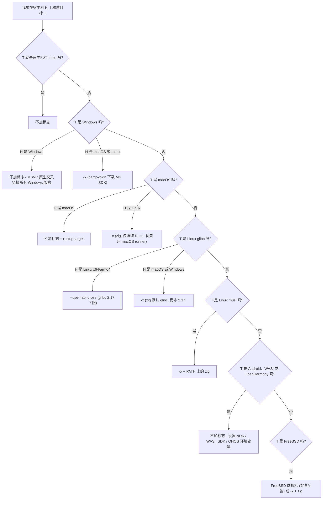

# 交叉编译

交叉编译一个 **NAPI-RS** addon，指的是在另一种宿主机（比如 Linux x64 CI runner）上为目标平台（比如 `aarch64-unknown-linux-gnu`）构建 `.node` 二进制文件。`napi build` 通过两种推荐机制支持交叉编译：

- **`--use-napi-cross`**：用于在 Linux x64/arm64 宿主机上构建 Linux glibc 目标 —— 从 npm 下载 gcc 交叉工具链，把 glibc 下限固定在 2.17。
- **`--cross-compile`**（**`-x`**）：用于从非 Windows 宿主机构建 Windows MSVC 目标（通过 `cargo-xwin`），以及构建 musl 目标（通过 `cargo-zigbuild`）。当你的宿主机上无法使用 `--use-napi-cross` 或原生 runner 时，它还能通过 `cargo-zigbuild` 覆盖 glibc、macOS 和 FreeBSD 目标。

Android、WASI 和 OpenHarmony 目标完全不需要交叉编译标志：无论是否传入（以及传入哪个）交叉编译标志，CLI 都会根据平台环境变量（NDK / WASI SDK / OHOS SDK）配置它们的工具链。下方的[决策矩阵](#%E5%86%B3%E7%AD%96%E7%9F%A9%E9%98%B5)给出了每个目标的具体做法。NAPI-RS 之所以标准化到 zig/xwin 工具链，是因为它们远比基于容器的交叉编译轻量（[napi-rs#491](https://github.com/napi-rs/napi-rs/issues/491)）。

本页告诉你针对你的宿主机/目标组合应该使用哪种机制，以及如何应对最常出问题的两件事：glibc 版本和 C/C++ 依赖。关于每个标志的确切行为 —— 派生的命令、环境变量、组合规则 —— 参见 [`napi build` 标志参考](./cli/build#%E4%BA%A4%E5%8F%89%E7%BC%96%E8%AF%91%E6%A0%87%E5%BF%97)。[cross-build 演示项目](https://github.com/napi-rs/cross-build)展示了如何用这些机制在单个 Linux CI 宿主机上为众多平台构建 addon。

## 决策矩阵

**生成的 CI** 一列展示了 `napi new` 生成的 CI workflow 对该目标采用的做法。它是已知可用的参考配置 —— 拿不准时，照抄它即可。

| 目标                                                | 生成的 CI（参考配置）                   | 从 Linux x64/arm64              | 从 macOS                | 从 Windows              |
| --------------------------------------------------- | --------------------------------------- | ------------------------------- | ----------------------- | ----------------------- |
| `x86_64-apple-darwin`                               | `macos-latest`，不加标志                | `-x`[^1]                        | 不加标志                | 不支持                  |
| `aarch64-apple-darwin`                              | `macos-latest`，不加标志（原生）        | `-x`[^1]                        | 不加标志                | 不支持                  |
| `x86_64-pc-windows-msvc`                            | `windows-latest`，不加标志              | `-x`[^2]                        | `-x`[^2]                | 不加标志                |
| `i686-pc-windows-msvc`                              | `windows-latest`，不加标志              | `-x`[^2]                        | `-x`[^2]                | 不加标志                |
| `aarch64-pc-windows-msvc`                           | `windows-latest`（x64），不加标志       | `-x`[^2]                        | `-x`[^2]                | 不加标志                |
| `x86_64-unknown-linux-gnu`                          | `ubuntu-latest`，`--use-napi-cross`     | `--use-napi-cross`              | `-x`[^3]                | `-x`[^3]                |
| `aarch64-unknown-linux-gnu`                         | `ubuntu-latest`，`--use-napi-cross`     | `--use-napi-cross`              | `-x`[^3]                | `-x`[^3]                |
| `armv7-unknown-linux-gnueabihf`                     | `ubuntu-latest`，`--use-napi-cross`     | `--use-napi-cross`              | `-x`[^3]                | `-x`[^3]                |
| `x86_64-unknown-linux-musl`                         | `ubuntu-latest`，`-x` + zig 安装步骤    | `-x` + zig                      | `-x` + zig              | `-x` + zig              |
| `aarch64-unknown-linux-musl`                        | `ubuntu-latest`，`-x` + zig 安装步骤    | `-x` + zig                      | `-x` + zig              | `-x` + zig              |
| `aarch64-linux-android` / `armv7-linux-androideabi` | `ubuntu-latest`，不加标志（预装 NDK）   | 不加标志 + NDK 环境变量         | 不加标志 + NDK 环境变量 | 不加标志 + NDK 环境变量 |
| `wasm32-wasip1-threads`                             | `ubuntu-latest`，不加标志               | 不加标志                        | 不加标志                | 不加标志                |
| `x86_64-unknown-freebsd`                            | FreeBSD 15 虚拟机任务，不加标志（原生） | `-x` + zig[^4]                  | `-x` + zig[^4]          | `-x` + zig[^4]          |
| `powerpc64le` / `s390x` `-unknown-linux-gnu`        | 无生成的任务                            | `--use-napi-cross`              | —                       | —                       |
| `loongarch64` / `riscv64gc` `-unknown-linux-gnu`    | 无生成的任务                            | 不加标志 + 需自行安装的交叉 gcc | —                       | —                       |

[^1]: zig 只能为**纯 Rust crate** 链接 macOS 二进制 —— 链接 Apple framework 的依赖需要真正的 macOS SDK（`SDKROOT`）。优先使用 macOS runner。

[^2]: cargo-xwin 会自行下载 Microsoft CRT 和 Windows SDK；受 Microsoft 许可条款约束。它需要安装 `clang`（例如在 macOS 上 `brew install llvm`）。

[^3]: `--use-napi-cross` 只能在 Linux x64/arm64 宿主机上工作（下载的工具链是 Linux 二进制），因此在 macOS 或 Windows 上请改用 `-x` —— 但 glibc 下限会变成 zig 的默认值，而不是 2.17。参见 [Glibc 版本](#glibc-%E7%89%88%E6%9C%AC)。

[^4]: 在 `-x` 下，FreeBSD 和其他所有非 Windows 目标一样通过 cargo-zigbuild 构建 —— 确保 `PATH` 上有 `zig`；Linux 宿主机是经过最多实战检验的路径。如果你还想让测试也在 FreeBSD 上运行，请在 FreeBSD 虚拟机中运行它们。参见 [FreeBSD 构建方法](#freebsd)。

## 决策树



Windows 分支按目标的*平台*路由，因此 `x86_64-pc-windows-gnu` 也会落入 xwin 分支 —— 但 cargo-xwin 只支持 MSVC，对这个 triple 使用 `-x` 会失败。优先使用 `*-pc-windows-msvc` triple；如果确实需要 windows-gnu，请不加任何交叉编译标志构建 —— 参见[各目标的构建方法](#%E5%90%84%E7%9B%AE%E6%A0%87%E7%9A%84%E6%9E%84%E5%BB%BA%E6%96%B9%E6%B3%95)中的 windows-gnu 说明。

## 三个标志一览

|                | `--use-napi-cross`                                                                                                                                                                      | `--cross-compile` / `-x`                                                                                                                                                    | `--use-cross`（遗留）                                                         |
| -------------- | --------------------------------------------------------------------------------------------------------------------------------------------------------------------------------------- | --------------------------------------------------------------------------------------------------------------------------------------------------------------------------- | ----------------------------------------------------------------------------- |
| **状态**       | Linux glibc 目标的推荐方案                                                                                                                                                              | 从非 Windows 宿主机构建 Windows MSVC 目标以及构建 musl 目标的推荐方案；当首选路径不可用时，是 glibc/macOS/FreeBSD 的 zig 兜底方案                                           | **遗留方案，不推荐**                                                          |
| **机制**       | 只设置环境变量：从 npm 下载 gcc 交叉工具链（[`@napi-rs/cross-toolchain`](https://github.com/napi-rs/cross-toolchain)），并把 linker/CC/sysroot 环境变量指向它；命令仍然是 `cargo build` | 替换 cargo 子命令：大多数目标用 `cargo zigbuild`，从非 Windows 宿主机构建 Windows 目标用 `cargo xwin build`（路由覆盖所有 `*-windows-*` triple，但 cargo-xwin 只支持 MSVC） | 替换二进制：`cross build` 在 Docker/Podman 容器内运行构建                     |
| **目标**       | 五个 Linux glibc triple：x64、arm64、armv7、ppc64le、s390x                                                                                                                              | 通过 zig 支持 Linux（gnu 和 musl）与 macOS 目标；通过 xwin 支持 Windows MSVC                                                                                                | 取决于 cross-rs 提供了哪些镜像 —— 仅限 Linux，没有 macOS 或 Windows MSVC 镜像 |
| **glibc 下限** | 2.17                                                                                                                                                                                    | zig 的默认值（zig 0.12–0.14 为 2.28）                                                                                                                                       | 镜像自带的 glibc（大多为 2.31；`:centos` 变体为 2.17）                        |
| **前置条件**   | Linux x64/arm64 宿主机，`PATH` 上有 `npm`；工具链会自动下载并缓存                                                                                                                       | zigbuild 路径需要 `PATH` 上有 `zig`，xwin 路径需要 `clang`（CLI 从不安装或检查这两者）；所选的 cargo 子命令（cargo-zigbuild 或 cargo-xwin）会在首次使用时自动安装           | 手动安装 `cross`，并有运行中的 Docker >= 20.10 或 Podman >= 3.4               |
| **C/C++ 依赖** | 用自带的 gcc 编译；aarch64 的 gcc 较老 —— 参见[已知限制](#%E5%8E%9F%E7%94%9F%E4%BE%9D%E8%B5%96)                                                                                         | 用 `zig cc` 编译；依赖 Apple framework 的依赖项需要 macOS SDK                                                                                                               | 完整的容器工具链 —— autotools/CMake 构建脚本的最后手段                        |

每次构建只能选用其中一个标志。这些标志不能组合使用，即使某些组合只会打印一条警告 —— 参见[组合规则](./cli/build#%E5%8F%AA%E8%83%BD%E9%80%89%E6%8B%A9%E4%B8%80%E4%B8%AA)。

## 各目标的构建方法

无论选择哪种机制，都必须先安装目标的 Rust 标准库：`rustup target add <triple>`。每个构建方法都以一条可直接复制粘贴的命令结尾，并附带说明生成的 CI 是如何构建同一目标的。

### Linux glibc (x64, arm64, armv7)

在 Linux x64/arm64 宿主机上使用 `--use-napi-cross`：它针对 glibc 2.17 构建，因此二进制几乎可以在所有 glibc 发行版上加载。在 macOS 或 Windows 上改用 `-x`（zig 在两者上都能运行）—— 代价是 glibc 下限变成 zig 更高的默认值。

```sh
napi build --release --target aarch64-unknown-linux-gnu --use-napi-cross
```

生成的 CI 正是用这个标志在 `ubuntu-latest` 上构建 `x86_64-unknown-linux-gnu`、`aarch64-unknown-linux-gnu` 和 `armv7-unknown-linux-gnueabihf`。

### Linux musl (x64, arm64)

在任意宿主机上使用 `-x`，并确保安装了 `zig` 且在 `PATH` 上。对于 musl 目标，CLI 会自动向 `RUSTFLAGS` 追加 `-C target-feature=-crt-static`。不要为了解决 `GLIBC_x.yy not found` 错误而改用 musl —— 那是 glibc 下限的问题，参见 [Glibc 版本](#glibc-%E7%89%88%E6%9C%AC)。

```sh
napi build --release --target aarch64-unknown-linux-musl --cross-compile
```

生成的 CI 在 setup-zig 步骤之后，用 `-x` 在 `ubuntu-latest` 上构建两个 musl 目标。

### 从 macOS 或 Linux 构建 Windows (MSVC)

使用 `-x`：构建会走 cargo-xwin，它会自行下载 Microsoft CRT 和 Windows SDK（受 Microsoft 许可条款约束）。你需要安装 `clang`（`apt install clang` / `brew install llvm`）。对于 `i686`，CLI 会自动设置 `XWIN_ARCH=x86`。在 Windows 宿主机上则完全不需要标志 —— MSVC 原生就能交叉链接 x64、x86 和 arm64。

```sh
napi build --release --target x86_64-pc-windows-msvc --cross-compile
```

生成的 CI 在 `windows-latest` 上不加标志构建全部三个 MSVC 目标；没有 Windows runner 时再使用 `-x`。

那 `*-pc-windows-gnu` 呢？自 [napi-rs#2935](https://github.com/napi-rs/napi-rs/pull/2935) 起，`x86_64-pc-windows-gnu` 是 CLI 接受的目标（当 Node 本身是 MINGW 构建时，生成的 JS loader 会选择 `win32-x64-gnu` 二进制）；其他 windows-gnu 架构不被接受。**不要**对它使用 `-x`：cargo-xwin 只支持 MSVC triple，因此对 windows-gnu 它什么都不配置，构建随后会以 ``error: linker `x86_64-w64-mingw32-gcc` not found`` 失败。请改为不加交叉编译标志构建：`rustup target add x86_64-pc-windows-gnu`，安装 mingw-w64 工具链（`apt install mingw-w64` / `brew install mingw-w64`），并把 `LIBNODE_PATH` 设置为一个包含 MSYS2 版 Node 提供的 `libnode.dll` 的目录 —— napi-build 会让 windows-gnu addon 直接链接它。这个目标通常在 MSYS2/MINGW 环境内构建，那里两个前置条件都已具备。目前仍然没有官方的 Node.js windows-gnu 构建，所以除非你专门面向 MSYS2/MINGW 的 Node，否则请改为构建 `*-pc-windows-msvc` triple —— 历史背景见 [napi-rs#2001](https://github.com/napi-rs/napi-rs/issues/2001)。

### macOS

在 macOS 宿主机上不需要交叉编译标志 —— 用 `rustup target add` 添加另一个架构然后构建即可。生成的 CI 还会设置 `MACOSX_DEPLOYMENT_TARGET: '10.13'` 来固定最低 macOS 版本。从 Linux 构建时，`-x` 只对纯 Rust crate 有效：链接 Apple framework 的依赖需要真正的 macOS SDK（`SDKROOT`），因此优先使用 macOS runner。不支持从 Windows 构建 macOS 目标。

```sh
napi build --release --target aarch64-apple-darwin
```

生成的 CI 在 `macos-latest` 上不加标志原生构建两个 darwin 目标。

### Android

不需要交叉编译标志。CLI 根据 `ANDROID_NDK_LATEST_HOME` 环境变量（GitHub `ubuntu-latest` runner 上预装）配置工具链，无论是否传入交叉编译标志。

```sh
napi build --release --target aarch64-linux-android
```

生成的 CI 在 `ubuntu-latest` 上不加标志构建 `aarch64-linux-android` 和 `armv7-linux-androideabi`。

### WASI

不需要交叉编译标志。链接由 rustup 自带的 `rust-lld` 处理。`WASI_SDK_PATH` 是可选的 —— 但一旦设置，就必须指向一个存在的目录 —— 而且无论是否传入交叉编译标志，CLI 都会读取它。

```sh
napi build --release --target wasm32-wasip1-threads
```

生成的 CI 已经在 `ubuntu-latest` 上构建 `wasm32-wasip1-threads` —— 无需标志。

### FreeBSD

有两种可用的配置。参考配置是生成的 CI 的做法：在 `ubuntu-latest` runner 上借助 `cross-platform-actions/action` 在 FreeBSD 15 虚拟机内原生构建 —— 不加交叉编译标志。生成的任务只负责构建并上传产物；如果你还想让测试也在 FreeBSD 上运行，需要自己把那个步骤加进虚拟机脚本。FreeBSD 也可以从 Linux 交叉编译：在 `-x` 下它和其他所有非 Windows 目标一样通过 cargo-zigbuild 构建 —— 在装有 zig 的 Linux 宿主机上运行。zig 的常见注意事项同样适用：C/C++ 依赖由 `zig cc` 编译（参见[原生依赖](#%E5%8E%9F%E7%94%9F%E4%BE%9D%E8%B5%96)）。

```sh
napi build --release --target x86_64-unknown-freebsd --cross-compile
```

生成的 CI 在 FreeBSD 15 虚拟机中原生构建；上面的 `-x` 命令是从 Linux 宿主机交叉编译的替代方案。

## Glibc 版本

`*-linux-gnu` 二进制动态链接 glibc，加载时要求系统 glibc 至少达到构建时所用的版本。**你的二进制会继承构建宿主机的 glibc 作为下限**：在最新的发行版上不加交叉编译标志构建，旧发行版上的用户就会看到：

```
Error: /lib/x86_64-linux-gnu/libc.so.6: version `GLIBC_2.38' not found
```

这个错误的含义是：请针对更老的 glibc 构建。它**不**意味着：换成 musl 目标。

- `--use-napi-cross` 把下限固定在 **glibc 2.17**（与 manylinux2014 一致），与宿主机发行版无关。
- `-x` 针对 **zig 的默认 glibc** 构建 —— zig 0.12–0.14 为 2.28 —— 而不是 2.17。
- 通过给 triple 加后缀来固定明确版本（`--target aarch64-unknown-linux-gnu.2.17`）**目前尚不支持**：该后缀会破坏 CLI 的产物查找。请关注 [napi-rs#3176](https://github.com/napi-rs/napi-rs/issues/3176)。

## 校验构建产物

发布之前，确认二进制属于预期的架构、所需的 glibc 版本没有超出你的目标范围：

```sh
# CPU architecture and file format
file my-package.linux-arm64-gnu.node

# Highest glibc symbol version the binary requires
objdump -T my-package.linux-arm64-gnu.node | grep -o 'GLIBC_[0-9.]*' | sort -Vu | tail -1
```

用 `--use-napi-cross` 构建时最高应为 `GLIBC_2.17`，用 `-x` 构建时应为 zig 的默认值。

## 原生依赖

C/C++ 依赖是交叉编译中最常见的障碍：`ring`、`openssl-sys`、`zstd-sys` 之类的 crate 会通过构建脚本编译 C 源码，这需要一个面向你的*目标*的 C 编译器 —— 只配置 rustc 是不够的。

- **基于 cc 的 crate（`ring` 等）**：设置 `TARGET_CC=clang` —— clang 天生就是交叉编译器。`TARGET_CC` 的优先级高于 `CC`（自 `@napi-rs/cli` 3.0.0-alpha.92 起）。

  ```sh
  TARGET_CC=clang napi build --release --target aarch64-unknown-linux-gnu --use-napi-cross
  ```

- **已知限制 —— `aws-lc-sys`**：默认的 rustls 后端（由 `reqwest`、`hyper-rustls` 等间接引入）在用 `--use-napi-cross` 为 aarch64 构建时会失败，因为自带的 gcc 太老（[cross-toolchain#4](https://github.com/napi-rs/cross-toolchain/issues/4)）。可以用 `TARGET_CC=clang` 绕过，或改用 `-x`。
- **TLS / OpenSSL**：优先使用带 `ring` 后端的 rustls，或启用 `openssl-sys` 的 `vendored` feature，让 OpenSSL 用交叉工具链从源码编译，而不是链接宿主机的库。
- **最后手段**：构建脚本运行 autotools 或 CMake 并连带使用宿主机 binutils 的依赖，可能只有在遗留的容器路径（`--use-cross`）中才能构建成功 —— 那里的整套工具链都与目标一致。

## Docker 镜像已弃用

::: warning
预构建的 Docker 镜像（`ghcr.io/napi-rs/napi-rs/nodejs-rust:*`）以及基于
`*.Dockerfile` 的构建已**弃用**。请迁移到普通 `ubuntu-latest` runner 上的
`--use-napi-cross`（Linux glibc 目标）或 `-x`（musl 目标）。

:::

| 旧镜像（`ghcr.io/napi-rs/napi-rs/...`）         | 普通 `ubuntu-latest` 上的新配置                                                                                         |
| ----------------------------------------------- | ----------------------------------------------------------------------------------------------------------------------- |
| `nodejs-rust:lts-debian`                        | `napi build --release --target x86_64-unknown-linux-gnu --use-napi-cross` —— 与 Debian 镜像提供的相同的 glibc 2.17 下限 |
| `nodejs-rust:lts-debian-aarch64`                | `napi build --release --target aarch64-unknown-linux-gnu --use-napi-cross`                                              |
| `nodejs-rust:lts-alpine`                        | 安装 zig，然后 `napi build --release --target x86_64-unknown-linux-musl -x`                                             |
| `nodejs-rust:lts-debian-zig` / `lts-alpine-zig` | 安装 zig，然后 `napi build --release --target <triple> -x`                                                              |

如果你仍在使用这些镜像，请遵守两条规则。第一，在镜像内只运行普通的 `napi build --target <triple>`，**不要加任何交叉编译标志** —— 镜像已经固定了工具链和 glibc，在此之上再叠加交叉编译标志正是构建失败的原因。第二，按摘要固定镜像版本（`nodejs-rust@sha256:...`），因为 `lts-*` 标签会随时间变化。

## 向现有项目添加新目标

1. 把 triple 加入 `napi` 配置的 `targets`（参见 [napi 配置](./cli/napi-config)）。
2. 运行 `napi create-npm-dirs` 生成各平台的 npm 包。
3. 为该目标添加一条 CI matrix 记录 —— 从生成的 CI 里复制最接近的任务（[决策矩阵](#%E5%86%B3%E7%AD%96%E7%9F%A9%E9%98%B5)告诉你该用哪个 runner 和标志）。
4. 升级 `@napi-rs/cli` 之后 —— 尤其是跨大版本升级时 —— 请用全新的 `napi new` 脚手架重新生成 CI workflow，而不是在旧文件上打补丁，以免它偏离 CLI 的预期。

## 另请参阅

- [`napi build` 交叉编译标志参考](./cli/build#%E4%BA%A4%E5%8F%89%E7%BC%96%E8%AF%91%E6%A0%87%E5%BF%97) —— 确切命令、环境变量约定、组合规则
- [FAQ：为 Linux alpine 构建](./more/faq#%E4%B8%BA-linux-alpine-%E6%9E%84%E5%BB%BA) —— musl 相关细节

## 赞助我们的团队

https://github.com/sponsors/napi-rs/

在开源社区中集成并正确配置跨平台编译工具链是一件非常繁琐、非常耗费人力的事情。理解这些编译参数并解决其中潜在的 bug 非常耗时，而且很难测试。
特别感谢我们的团队成员 [@messense](https://github.com/messense)，他一直在开发 `cargo-xwin` 和 `cargo-zigbuild`，正是它们让我们能够在非 Windows 系统上构建 Windows 原生 addon。

如果你的公司正在使用 **NAPI-RS**，请考虑赞助我们的团队，支持 NAPI-RS 的开发。我们将非常感谢你的支持。
