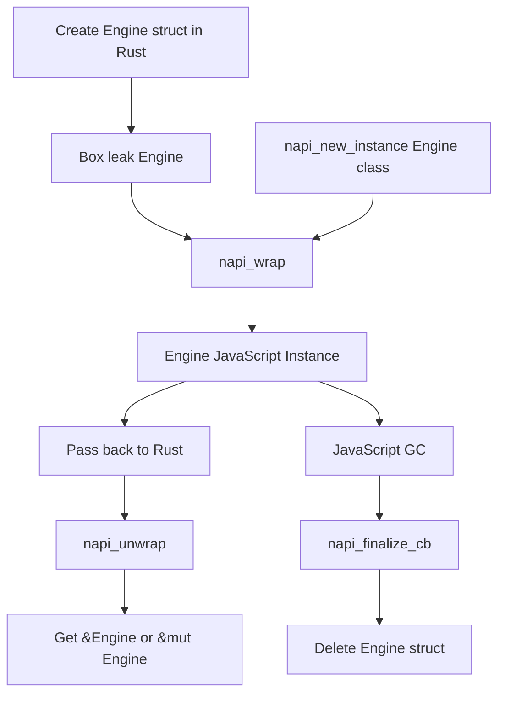
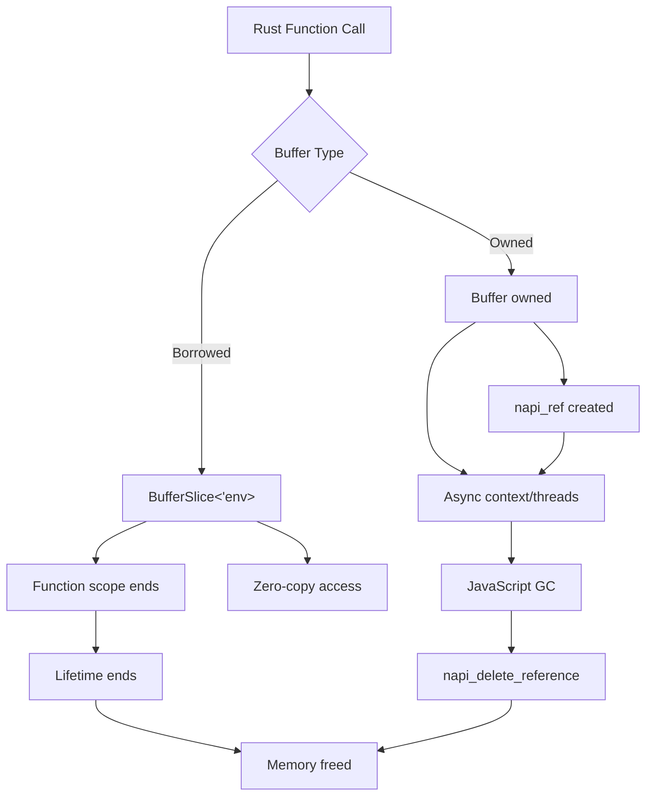

import { Callout } from 'nextra-theme-docs'

import NodeLink from '../../../components/node-link'

# Understanding Lifetime

Interoperability between the `Rust` lifetime system and `JavaScript` memory management is tricky. In most cases, you can't use the JavaScript values passed into the Rust function. However, there are <NodeLink href="https://nodejs.org/api/n-api.html#references-to-values-with-a-lifespan-longer-than-that-of-the-native-method">a bunch of APIs in Node-API</NodeLink> that can extend the lifetime of the `JavaScript` values. **NAPI-RS** uses these APIs to align the lifetime of the `JavaScript` values with the `Rust` lifetime system as much as possible.

In a Node-API function call, JavaScript values pointer only valid until the function call ends, see <NodeLink href="https://nodejs.org/api/n-api.html#object-lifetime-management">Object Lifetime Management</NodeLink>.

> As Node-API calls are made, handles to objects in the heap for the underlying VM may be returned as napi_values. These handles must hold the objects 'live' until they are no longer required by the native code, otherwise the objects could be collected before the native code was finished using them. <br/><br/>
> As object handles are returned they are associated with a 'scope'. The lifespan for the default scope is tied to the lifespan of the native method call. The result is that, by default, handles remain valid and the objects associated with these handles will be held live for the lifespan of the native method call.

## Lifetime of primitive values

Primitive values like `boolean`, `number`, `string`, `null`, and `undefined` are passed by value, so the underlying values are copied when passed to the Rust side. These values don't have a lifetime.

## Lifetime of `JsValue`

Some JavaScript values, like `JsNumber` or `JsString`, they can be consumed in various forms.
For example, `JsNumber` can be consumed as `f64` or `i32` in Rust.

```rust filename="lib.rs"
use napi::{bindgen_prelude::Either, JsNumber};
use napi_derive::napi;

#[napi]
pub fn add(a: JsNumber) -> Result<Either<u32, f64>> {
  let input_u32 = input.get_uint32()?;
  let input_f64 = input.get_double()?;
  if input_u32 as f64 == input_f64 {
    Ok(Either::B(input_u32))
  } else {
    Ok(Either::A(input_f64))
  }
}
```

So we preserve the underlying raw pointer to the JavaScript value. These values come with a lifetime: `JsNumber<'a>`, which means you can't use them outside the function call. You don't need to specify the lifetime explicitly in most cases—it equals the function's default lifetime.

## Lifetime of class instances

In `#[napi]` class, the instance is created by the Rust side and sent the ownership to the JavaScript side:

```rust filename="lib.rs"
use std::sync::Arc;

use napi_derive::napi;

#[napi]
pub struct Engine {
  inner: Arc<()>,
}

#[napi]
impl Engine {
  #[napi(constructor)]
  pub fn new() -> Self {
    Self { inner: Arc::new(()) }
  }
}
```

```ts filename="index.ts"
const engine = new Engine()
```

In this case, the `Engine` instance is created in the constructor and returned to JavaScript.

Unlike `JsNumber` or `JsString`, the `Engine` holds the Rust struct under the hood, so if it's passed back from the JavaScript side, you can get the `&Engine` or `&mut Engine` directly.

### Class instances Lifetime Flowchart

The following flowchart illustrates the lifetime of a NAPI-RS struct instance lifetime:



## Lifetime of `Buffer` and `TypedArray`

`Buffer` and `TypedArray` are special types in NAPI-RS. They are not just a wrapper of the underlying raw pointer, but also a wrapper of the data of the underlying `ArrayBuffer`.

NAPI-RS provides two categories of buffer types with different lifetime characteristics:

### Owned Types - Cross-Thread Lifetime

Owned types (`Buffer`, `Uint8Array`, etc.) use reference counting to manage their lifetime:

- The underlying data is wrapped with <NodeLink href="https://nodejs.org/api/n-api.html#napi_create_reference">`napi_ref`</NodeLink>
- They can be used across async boundaries and threads
- Lifetime extends beyond the function scope until the JavaScript GC runs

```rust filename="lib.rs"
use napi::bindgen_prelude::*;
use napi_derive::napi;

#[napi]
pub fn print_buffer(buffer: Buffer) {
  std::thread::spawn(move || {
    // Buffer can be moved across threads
    let data: Vec<u8> = buffer.into();
    println!("data: {:?}", data);
  });
}
```

<Callout type="info">
  We don't provide the
  <NodeLink href="https://nodejs.org/api/n-api.html#napi_reference_ref">`napi_reference_ref`</NodeLink>
  and
  <NodeLink href="https://nodejs.org/api/n-api.html#napi_reference_unref">`napi_reference_unref`</NodeLink>
  in NAPI-RS. Because these APIs are not threadsafe and don't conform to the
  *RAII* pattern.

The owned types will be dropped when they go out of scope. At that time, the underlying `napi_ref` will be deleted via the <NodeLink href="https://nodejs.org/api/n-api.html#napi_delete_reference">`napi_delete_reference`</NodeLink> API.

If the owned types are sent to other threads, there will be a global `ThreadsafeFunction` to receive the `napi_ref` in threads that cannot access the `napi_env` and delete it in the `ThreadsafeFunction` callback, which is guaranteed to be in the JavaScript thread. This mechanism ensures no memory leaks occur.

</Callout>

### Borrowed Types - Function Scope Lifetime

Borrowed types (`BufferSlice<'env>`, `Uint8ArraySlice<'env>`, etc.) have lifetimes bound to the function scope:

- Zero-copy access to the underlying data
- Cannot cross async boundaries due to lifetime constraints
- Must be used within the same function call where they were created

```rust filename="lib.rs"
use napi::bindgen_prelude::*;
use napi_derive::napi;

#[napi]
pub fn process_buffer_slice<'env>(env: &'env Env, data: &'env [u8]) -> Result<BufferSlice<'env>> {
  // BufferSlice lifetime is bound to this function scope
  BufferSlice::from_data(env, data.to_vec())
}
```

### Buffer Lifetime Flowchart



### When Lifetimes Matter

**Function-scoped lifetime (`BufferSlice<'env>`):**

```rust filename="lib.rs"
use napi::bindgen_prelude::*;
use napi_derive::napi;

#[napi]
pub fn sync_only(env: &Env) -> Result<BufferSlice<'_>> {
  // ✅ Works: BufferSlice lifetime tied to function scope
  BufferSlice::from_data(env, vec![1, 2, 3])
}

// ❌ Won't compile: Cannot cross async boundaries
// #[napi]
// async fn async_fail(env: &Env) -> Result<BufferSlice<'_>> {
//     let slice = BufferSlice::from_data(env, vec![1, 2, 3])?;
//     tokio::time::sleep(Duration::from_millis(100)).await;
//     Ok(slice) // Error: slice doesn't live long enough
// }
```

**Reference-counted lifetime (`Buffer`):**

```rust filename="lib.rs"
use napi::bindgen_prelude::*;
use napi_derive::napi;

#[napi]
pub async fn async_works(buffer: Buffer) -> Result<Buffer> {
  // ✅ Works: Buffer is Send + Sync
  tokio::time::sleep(Duration::from_millis(100)).await;
  Ok(buffer)
}
```

For more details on Buffer and TypedArray usage patterns, see the [TypedArray documentation](/docs/concepts/typed-array).

## JavaScript Value Reference

Except for `Buffer` and `TypedArray`, you can also create `ObjectRef`, `ExternalRef`, `SymbolRef`, and `FunctionRef`.

These reference types own the underlying `JavaScript` values, so they don't need to have a lifetime.

See [Reference](/docs/concepts/reference#javascript-value-reference) for more details.
