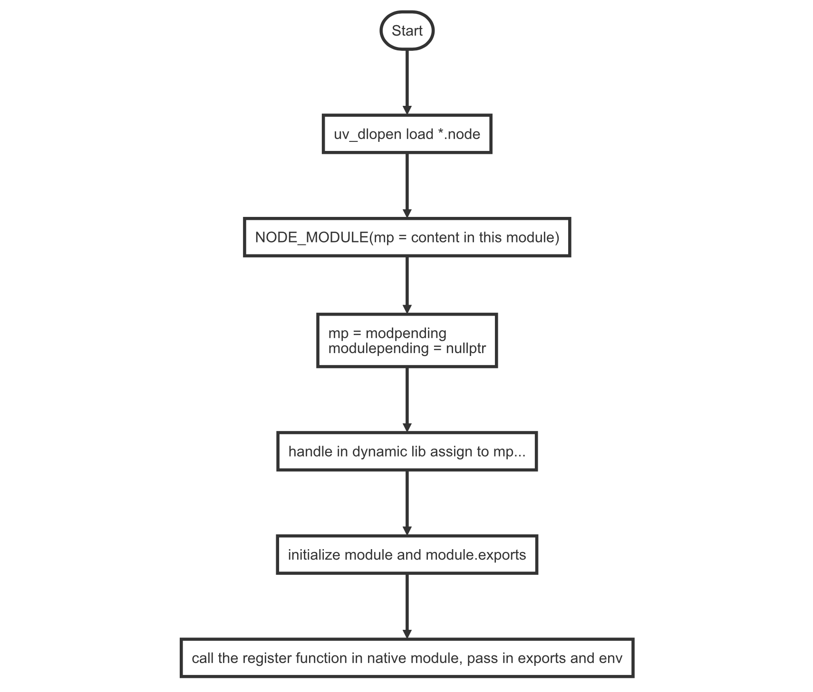

# Módulo nativo

> Alguns conteúdos foram retirados de https://xcoder.in/2017/07/01/nodejs-addon-history/

## A Natureza dos Módulos Nativos

Vamos começar com o desenvolvimento do módulo C++ mais essencial para o Node.js. Por exemplo, temos um módulo nativo legítimo chamado `pinyin.linux-x64-gnu.node` no Linux, que é na verdade um arquivo binário que não pode ser visualizado corretamente em um editor de texto, até encontrarmos um visualizador de binário.


O leitor perspicaz verá que seu Número Mágico[^1] é `0x7F454C46` e o código ASCII que ele pressiona é ELF, então a resposta é óbvia: é um arquivo **_DLL_** para Linux.

Na verdade, não apenas no Linux. Quando um módulo C++ do Node.js é compilado no OSX, você obtém uma DLL com o sufixo `*.node`, que essencialmente é `*.dylib`, e no Windows, você obtém uma DLL com o sufixo `*.node`, que essencialmente é `*.dll`.

SEsse tipo de módulo, quando requerido no Node.js, é exigido por meio de `process.dlopen()`. Vamos dar uma olhada na função DLOpen[^2] no Node.js [v10.23.0](https://github.com/nodejs/node/blob/v10.23.0/src/node.cc#L1232):

```cpp
// DLOpen is process.dlopen(module, filename, flags).
void DLOpen(const FunctionCallbackInfo<Value>& args) {
  Environment* env = Environment::GetCurrent(args);
  auto context = env->context();

  Local<Object> module;
  Local<Object> exports;
  Local<Value> exports_v;
  // initialize `module`, `module.exports` values
  if (!args[0]->ToObject(context).ToLocal(&module) ||
      // this line is equal to `exports = module.exports`
      !module->Get(context, env->exports_string()).ToLocal(&exports_v) ||
      !exports_v->ToObject(context).ToLocal(&exports)) {
    return;  // Exception pending.
  }

  node::Utf8Value filename(env->isolate(), args[1]);  // Cast
  DLib dlib(*filename, flags);
  bool is_opened = dlib.Open();

  node_module* const mp = static_cast<node_module*>(
      uv_key_get(&thread_local_modpending));
  uv_key_set(&thread_local_modpending, nullptr);

  ...

  // transfer the handle in dynamic lib to the `mp`
  mp->nm_dso_handle = dlib.handle_;
  mp->nm_link = modlist_addon;
  modlist_addon = mp;

  if (mp->nm_context_register_func != nullptr) {
    mp->nm_context_register_func(exports, module, context, mp->nm_priv);
  } else if (mp->nm_register_func != nullptr) {
    mp->nm_register_func(exports, module, mp->nm_priv);
  } else {
    dlib.Close();
    env->ThrowError("Module has no declared entry point.");
    return;
  }

}
```

Logicamente, o processo de carregamento realmente se parece com isso.

- Carrega a biblioteca de link via `uv_dlopen`.
- Hook da biblioteca carregada na tabela de cadeia de módulos nativos.
- Inicializa o módulo com `mp->nm_register_func()`, e obtém o módulo e module.exports que estão lá.

O fluxo descendente é semelhante a este diagrama de fluxo:



## Como construir um módulo nativo

### `node-waf`

Antes do Node.js 0.8, os desenvolvedores usavam o `node-waf` para construir suas bibliotecas. Claro, o `node-waf` não é o node-waf no registro npm, o `node-waf` original estava abandonado há anos.

Isso era configurado com um arquivo chamado `wscript`. A partir do Node.js 0.8, ele tinha o `node-gyp` integrado, então as pessoas não precisavam mais do wscript.

Mas devido a essa escassez temporária, muitas bibliotecas que usam C++ para construir um addon do Node.js continham tanto `binding.gyp` quanto `wscript` naquela época.

Você pode ver arquivos daquela época nesta biblioteca [node-mysql-libmysqlclient](https://github.com/Sannis/node-mysql-libmysqlclient/tree/9545ea7485fcc8b07b7c56c5ec3575938bfd4e5f). Para ter suporte ao node-gyp, ele tinha `binding.gyp` e ainda mantinha o arquivo `wscript`.

### `node-gyp`

Este recurso está presente no Node.js desde o Node.js v0.8, antes disso, seu pacote padrão de ajuda para compilação era o `node-waf` (veja abaixo), o que deve ser familiar para os antigos usuários do Node.

### `GYP`

`node-gyp` é baseado em `GYP`[^3]. Ele reconhece o arquivo `binding.gyp`[^4] em um pacote ou projeto e, em seguida, gera projetos compiláveis para cada sistema com base nesse arquivo de configuração, como **arquivos de projeto do Visual Studio (\*.sln, etc.)** para Windows e Makefiles para Unix. `node-gyp` também pode invocar ferramentas de compilação do sistema (como o GCC) para compilar o projeto para um arquivo final de DLL \*.node.

> Como você pode ver pela descrição acima, compilar módulos nativos C++ no Windows depende do Visual Studio, razão pela qual você precisará ter o Visual Studio pré-instalado para instalar alguns pacotes do Node.js. <br/>
> Na verdade, para usuários que não precisam do Visual Studio, não é necessário, já que o node-gyp só depende de seu compilador, não do IDE. Aqueles que desejam simplificar a instalação podem visitar [https://download.microsoft.com/download/5/f/7/5f7acaeb-8363-451f-9425-68a90f98b238/visualcppbuildtools_full.exe](https://download.microsoft.com/download/5/f/7/5f7acaeb-8363-451f-9425-68a90f98b238/visualcppbuildtools_full.exe) diretamente. cpp-build-tools Baixe a instalação das Ferramentas de Compilação do Visual CPP ou instale-as a partir da linha de comando `npm install --global --production windows-build-tools` para obter as ferramentas de compilação que você merece.

Agora que isso está claro, vamos dar uma olhada na estrutura básica do `binding.gyp`:

```text filename="binding.gyp"
{
  "targets": [{
    "target_name": "addon1",
    "sources": [ "1/addon.cc", "1/myobject.cc" ]
  }, {
    "target_name": "addon2",
    "sources": [ "2/addon.cc", "2/myobject.cc" ]
  }, {
    "target_name": "addon3",
    "sources": [ "3/addon.cc", "3/myobject.cc" ]
  }, {
    "target_name": "addon4",
    "sources": [ "4/addon.cc", "4/myobject.cc" ]
  }]
}
```

Esta configuração conta a seguinte história:

- Quatro módulos nativos em C++ são definidos.
- O código-fonte para cada módulo é **\*.addon.cc** e **\*.myobject.cc**, respectivamente.
- Os nomes dos quatro módulos são **addon1** a **addon4**.
- A história oculta: Esses módulos existem em **build/Release/addon\*.node** após a compilação.

Para obter mais informações sobre o arquivo de configuração GYP, você pode consultar a documentação oficial, que tem um link para GYP em uma nota de rodapé.

#### Algo mais sobre `node-gyp`

Além de ser baseado em GYP, o node-gyp faz algumas coisas extras. Em primeiro lugar, quando compilamos uma extensão nativa em C++, ele vai para o diretório especificado (geralmente `~/.node-gyp`) e procura pelas cabeçalhos da versão atual do Node.js e bibliotecas vinculadas estaticamente, e se elas não existirem, ele fervorosamente vai para o site do Node.js para baixá-las.

Esta é uma estrutura de diretórios para a versão específica de cabeçalhos e bibliotecas do Node.js baixadas do node-gyp no macOS:

```text
/Users/napi-rs/.node-gyp
└── 14.15.1
    └── include
        └── node
            ├── common.gypi
            ├── config.gypi
            ├── cppgc
            ├── js_native_api.h
            ├── js_native_api_types.h
            ├── libplatform
            ├── node.h
            ├── node_api.h
            ├── node_api_types.h
            ├── node_buffer.h
            ├── node_object_wrap.h
            ├── node_version.h
            ├── openssl
            ├── uv
            ├── uv.h
            ├── v8-fast-api-calls.h
            ├── v8-internal.h
            ├── v8-platform.h
            ├── v8-profiler.h
            ├── v8-util.h
            ├── v8-value-serializer-version.h
            ├── v8-version-string.h
            ├── v8-version.h
            ├── v8-wasm-trap-handler-posix.h
            ├── v8-wasm-trap-handler-win.h
            ├── v8.h
            └── v8config.h
```

Este diretório de cabeçalhos será mesclado em nosso `binding.gyp` na forma de um campo `"include_dirs"` quando o `node-gyp` for compilado; em resumo, todos os cabeçalhos podem ser `#include` diretamente.

O node-gyp é um programa de linha de comando que pode ser executado diretamente a partir de `$ node-gyp` após a instalação. Ele tem alguns subcomandos para você usar.

- `$ node-gyp configure`: gera arquivos de projeto, como Makefiles, a partir do binding.gyp no diretório atual.
- `$ node-gyp build`: constrói e compila o projeto atual, que deve ser precedido por `configure`.
- `$ node-gyp clean`: limpa os arquivos de construção resultantes e os diretórios de saída, em outras palavras, limpa os diretórios.
- `$ node-gyp rebuild`: Isso é equivalente à execução de `clean`, `configure` e `build` em sequência.
- `$ node-gyp install`: Baixa manualmente os arquivos de cabeçalho e os arquivos de biblioteca da versão atual do Node.js para o diretório apropriado.

## Conclusão

Neste capítulo, introduzimos o que é um _Node.js native addon_ e como compilá-lo. No próximo capítulo, revisaremos a história das alterações na API relacionadas ao _native addon_ no Node.js e formalmente apresentaremos nosso protagonista: o N-API.

## Referências

[^1]: https://en.wikipedia.org/wiki/Magic_number_(programming)
[^2]: https://github.com/nodejs/node/blob/v6.9.4/src/node.cc#L2427-L2502
[^3]: GYP significa _Generate Your Projects_, um sistema de compilação desenvolvido pelo Google. Para mais detalhes: https://gyp.gsrc.io.
[^4]: O arquivo de configuração do GYP geralmente tem uma extensão _.gyp, ou _.gypi. É um arquivo JSON-like.
