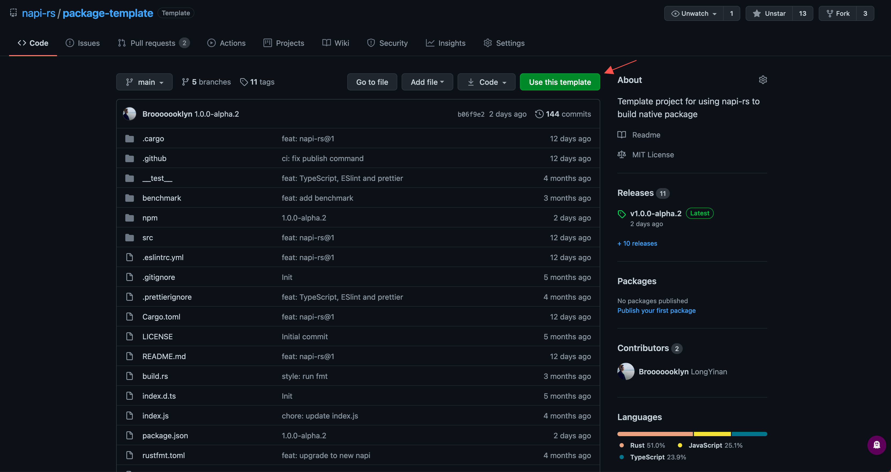

# Getting started

import Video from '../../../public/assets/napi-rs-guide.mp4'

## Start from `@napi-rs/cli`

> The recommend way.

<br />

<video controls style={{ width: '100%' }}>
  <source src={Video} type="video/mp4" />
  <track kind="captions" srcLang="en" />
</video>

### Install cli

```bash
yarn global add @napi-rs/cli
# or
npm install -g @napi-rs/cli
# or
pnpm add -g @napi-rs/cli
```

### Create project

```bash
napi new
```
This will then prompt you for some variables, including:

#### Package name

The name that will be defined in `package.json`.

#### Target platforms

Specify the target platforms you want to support with the native package.

#### Enable GitHub actions

Opt in for generated GitHub actions that will help publish the native package to the npm registry.

### Deep dive

It is recommended to distribute your package under [npm scope](https://docs.npmjs.com/creating-and-publishing-scoped-public-packages/) because `@napi-rs/cli` by default napi will append the different platform suffixes to the npm package name as the package name for the different platform binary distributions. Using npm scope will help reduce the chance that the package name was already taken.

For example if you want publish package `@cool/core`, with the `macOS x64`, `Windows x64` and `Linux aarch64` supported, `@napi-rs/cli` will create and publish four packages for you:

- `@cool/core` includes just `JavaScript` codes, which actually load the native binary from per platforms.
- `@cool/core-darwin-x64` for `macOS x64` platform.
- `@cool/core-win32-x64` for `Windows x64` platform.
- `@cool/core-linux-arm64-gnu` for `Linux aarch64` platform.

In every platform binary package, there are `cpu` and `os` fields in there `package.json`:

```json filename="package.json"
{
  "name": "@cool/core-darwin-x64",
  "version": "1.0.0",
  "os": ["darwin"],
  "cpu": ["x64"]
}
```

And `@cool/core` will be using these native packages as `optionalDependencies`:

```json filename="package.json"
{
  "name": "@cool/core",
  "version": "1.0.0",
  "optionalDependencies": {
    "@cool/core-darwin-x64": "^1.0.0",
    "@cool/core-win32-x64": "^1.0.0",
    "@cool/core-linux-arm64": "^1.0.0"
  }
}
```

And the `index.js` in `@cool/core` will be:

```js filename="index.js"
const { existsSync, readFileSync } = require('fs')
const { join } = require('path')

const { platform, arch } = process

let nativeBinding = null
let localFileExisted = false
let isMusl = false
let loadError = null

switch (platform) {
  case 'darwin':
    switch (arch) {
      case 'x64':
        localFileExisted = existsSync(join(__dirname, 'core.darwin-x64.node'))
        try {
          if (localFileExisted) {
            nativeBinding = require('./core.darwin-x64.node')
          } else {
            nativeBinding = require('@cool/core-darwin-x64')
          }
        } catch (e) {
          loadError = e
        }
        break
      case 'arm64':
        localFileExisted = existsSync(join(__dirname, 'core.darwin-arm64.node'))
        try {
          if (localFileExisted) {
            nativeBinding = require('./core.darwin-arm64.node')
          } else {
            nativeBinding = require('@cool/core-darwin-arm64')
          }
        } catch (e) {
          loadError = e
        }
        break
      default:
        throw new Error(`Unsupported architecture on macOS: ${arch}`)
    }
    break
  // ...
  default:
    throw new Error(`Unsupported OS: ${platform}, architecture: ${arch}`)
}

if (!nativeBinding) {
  if (loadError) {
    throw loadError
  }
  throw new Error(`Failed to load native binding`)
}

const { plus100 } = nativeBinding

module.exports.plus100 = plus100
```

The generated `index.js` file is responsible for loading the **_right_** binary file depending on the target platform that is executing the package. The `index.js` also handles two cases:

#### Package installed in users `node_modules`

To load the correct binary, the `index.js` function tries to load all possible packages for that platform (there may be multiple possible binary packages for a given system and CPU architecture), for example, on the `Linux x64` platform, `index.js` tries to load `@cool/core-linux-x64-gnu` and `@cool/core-linux-x64-musl`. The package `@cool/core-linux-x64-gnu` will be loaded if the user is using an operating system like `Ubuntu` `Debian` with `gnu libc` pre-installed. And if the user is using an operating system like `Alpine` with `musl libc` pre-installed, then `@cool/core-linux-x64-musl` will be loaded.

#### Local development

The `build` command in package.json in the project generated by the `@napi-rs/cli` new command will generate the binary dynamic link library compiled from the `Rust` code into the current directory for debugging purposes. `index.js` will also try to load the corresponding binary from the current directory in this case. Again using `Linux x64` as an example, the `index.js` function will try to load the `core.linux-x64-gnu.node` and `core.linux-x64-musl.node` files in turn.

#### IDE support problem

If your IDE refuses to autocomplete/autosuggest code when using the `#[napi]` macro, you can use the following setting to fix this:

For vscode in `settings.json`:
```json
{
  "rust-analyzer.procMacro.ignored": { "napi-derive": ["napi"] }
}
```

For Neovim.
```toml
['rust-analyzer'] = {
    procMacro = {
        ignored = {
            ['napi-derive'] = { 'napi' },
        },
    },
},
```

This problem emits the following error in rust-analyser:
```
[ERROR proc_macro_api::msg] proc-macro tried to print : `napi` macro expand failed.
```


## Start from **GitHub template project**



1. Go to [GitHub template project](https://github.com/napi-rs/package-template)
2. **Click Use this template**.
3. Clone your project.
4. Run `yarn install` to install dependencies.
5. Run `npx napi rename` command under the project folder to rename your package.
