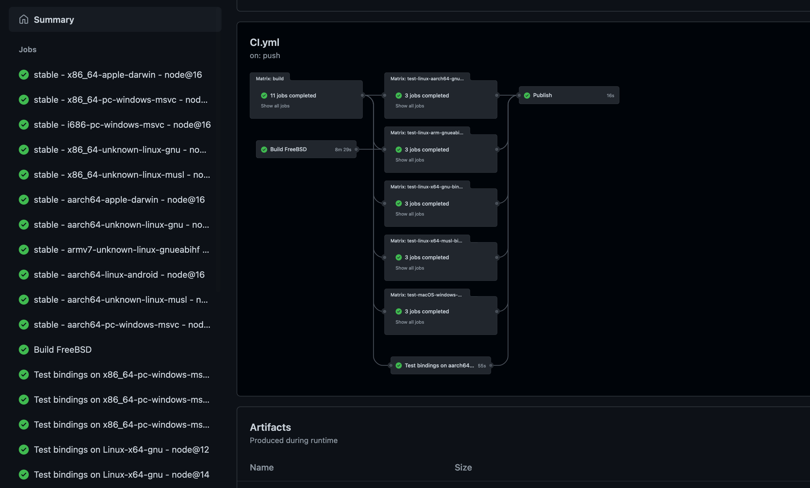

# A simple package

## Create `@napi-rs/cool`

Let's start from the `@napi-rs/cli`.

Create a new project with `napi new`:

```bash {2}
napi new
? Package name: (The name field in your package.json)
```

Let's give the package a cool name **@napi-rs/cool**:

import { Callout } from 'nextra-theme-docs'

<Callout type="warning" emoji="⚠️">
  It's recommend to use npm scope to name your package. Because `@napi-rs/cli`
  will create and publish many packages per platform for you. If these packages
  are not under a npm scope, it will trigger npm [**_spam
  detection_**](https://stackoverflow.com/a/54135900/5684750) while your are
  publishing them for the first time.
</Callout>

```bash {3}
napi new
? Package name: (The name field in your package.json) @napi-rs/cool
? Dir name: (cool)
```

Next step you need to choose the directory name for your cool package, the default value of it is the suffix of your package name. Let's just press **enter** and use the default value.

```bash {4}
napi new
? Package name: (The name field in your package.json) @napi-rs/cool
? Dir name: cool
? Choose targets you want to support (Press <space> to select, <a> to toggle all, <i> to invert selection,
and <enter> to proceed)
❯ ◯ aarch64-apple-darwin
  ◯ aarch64-linux-android
  ◯ aarch64-unknown-linux-gnu
  ◯ aarch64-unknown-linux-musl
  ◯ aarch64-pc-windows-msvc
  ◯ armv7-unknown-linux-gnueabihf
  ◉ x86_64-apple-darwin
(Move up and down to reveal more choices)
```

The next step is to choose which platform you want to support. I want all of them, so press **A** to choose all targets and press **enter**.

```bash {8}
napi new
? Package name: (The name field in your package.json) @napi-rs/cool
? Dir name: cool
? Choose targets you want to support aarch64-apple-darwin, aarch64-linux-android, aarch64-unknown-linux-gnu
, aarch64-unknown-linux-musl, aarch64-pc-windows-msvc, armv7-unknown-linux-gnueabihf, x86_64-apple-darwin,
x86_64-pc-windows-msvc, x86_64-unknown-linux-gnu, x86_64-unknown-linux-musl, x86_64-unknown-freebsd, i686-p
c-windows-msvc, armv7-linux-androideabi
? Enable github actions? (Y/n)
```

The next step you need to choose whether to enable the `GitHub CI` configuration. If your project will live on `GitHub` then you need to enable it. Let's type the **Y** and press **enter** here:

```bash {9-16}
napi new
? Package name: (The name field in your package.json) @napi-rs/cool
? Dir name: cool
? Choose targets you want to support aarch64-apple-darwin, aarch64-linux-android, aarch64-unknown-linux-gnu
, aarch64-unknown-linux-musl, aarch64-pc-windows-msvc, armv7-unknown-linux-gnueabihf, x86_64-apple-darwin,
x86_64-pc-windows-msvc, x86_64-unknown-linux-gnu, x86_64-unknown-linux-musl, x86_64-unknown-freebsd, i686-p
c-windows-msvc, armv7-linux-androideabi
? Enable github actions? Yes
Writing Cargo.toml
Writing .npmignore
Writing build.rs
Writing package.json
Writing src/lib.rs
Writing .github/workflows/CI.yml
Writing .cargo/config.toml
Writing rustfmt.toml
```

And now `@napi-rs/cli` has created a new package named `@napi-rs/cool` and under the `cool` directory.

Let's enter it and do some preparation:

```bash
cd cool
yarn install
```

I'm using `yarn` to install the dependencies here, you can replace it with your favorite package manager.

And now the directory structure looks like this:

```
tree -a
.
├── .cargo
│   └── config.toml
├── .github
│   └── workflows
│       └── CI.yml
├── .npmignore
├── Cargo.toml
├── build.rs
├── npm
├── package.json
├── rustfmt.toml
└── src
    └── lib.rs
```

Your native code is in `src/lib.rs`. The `.cargo/config.toml` file is used in the `GitHub CI` for cross compiling. In general, this file does not affect your development on your local machine.
The `.github/workflows/CI.yml` file is the configuration file for [`GitHub Actions`](https://docs.github.com/en/actions).
The `build.rs` file is necessary for building a native addon for `Node.js`. Don't delete it or move it to another place.

After the `yarn` installation finished, you can run the `build` command to build your first native package:

```bash
yarn build
yarn run v1.22.17
$ napi build --platform --release
    Updating crates.io index
  Downloaded proc-macro2 v1.0.34
  Downloaded once_cell v1.9.0
  Downloaded napi v2.0.0-beta.7
  Downloaded 3 crates (129.4 KB) in 2.35s
   Compiling proc-macro2 v1.0.34
   Compiling unicode-xid v0.2.2
   Compiling memchr v2.4.1
   Compiling syn v1.0.82
   Compiling regex-syntax v0.6.25
   Compiling convert_case v0.4.0
   Compiling once_cell v1.9.0
   Compiling napi-build v1.2.0
   Compiling napi-sys v2.1.0
   Compiling napi-rs_cool v0.0.0 (/cool)
   Compiling quote v1.0.10
   Compiling aho-corasick v0.7.18
   Compiling regex v1.5.4
   Compiling napi-derive-backend v1.0.17
   Compiling ctor v0.1.21
   Compiling napi-derive v2.0.0-beta.5
   Compiling napi v2.0.0-beta.7
    Finished release [optimized] target(s) in 37.11s
✨  Done in 37.80s.
```

And now the folder structure is like this:

```bash {11-13}
tree -a -I target
.
├── .cargo
│   └── config.toml
├── .github
│   └── workflows
│       └── CI.yml
├── .npmignore
├── Cargo.toml
├── build.rs
├── cool.darwin-x64.node
├── index.d.ts
├── index.js
├── node_modules
├── npm
├── package.json
├── rustfmt.toml
└── src
    └── lib.rs
```

Now there is three (3) more files that the `yarn build` command generated for you.

1. `cool.darwin-x64.node` is the Node.js addon binary file
2. `index.js` is the generated JavaScript binding file which helps you export everything in the addon to the package caller
3. `index.d.ts` is the generated TypeScript definition file.

The `new` command generated a simple `sum` function for you in the `src/lib.rs`:

```rust {7} filename="lib.rs"
#![deny(clippy::all)]

#[macro_use]
extern crate napi_derive;

#[napi]
fn sum(a: i32, b: i32) -> i32 {
  a + b
}
```

You can inspect the `index.d.ts` file and see the `sum` function typing that has been generated:

```ts {9} filename="index.d.ts"
/* eslint-disable */

export class ExternalObject<T> {
  readonly '': {
    readonly '': unique symbol
    [K: symbol]: T
  }
}
export function sum(a: number, b: number): number
```

Let's create a `main.mjs` file to test the generated `sum` function:

```js filename="main.mjs"
import { sum } from './index.js'

console.log('From native', sum(40, 2))
```

Execute it!

```bash
node main.mjs
From native 42
```

Congratulations! You have successfully created a native addon for `Node.js`!

## Publish it

Unfortunately, you can't publish the `@napi-rs/cool` because you don't have permission to publish packages to the `@napi-rs` npm scope.

However, you can create your own `npm scope`: https://docs.npmjs.com/creating-and-publishing-scoped-public-packages.

Once you have created your own npm scope, you can use the `napi rename` command to rename the project just created.

```bash {1}
napi rename
? name: name field in package.json
```

Let's assume you just created an npm scope named `jarvis`, you can type `@jarvis/cool` as the new name:

```bash {3}
napi rename
? name: name field in package.json @jarvis/cool
? napi name: (cool)
```

You don't need change the `napi name` field in the `package.json` because the package suffix is not changed. Just type **Enter** to keep the `cool` name.

```bash
napi rename
? name: name field in package.json @jarvis/cool
? napi name: cool
? repository: Leave empty to skip
```

And you need a `GitHub` repository if you want to publish a **NAPI-RS** package, because you need the `GitHub Actions` to do the compiling jobs for you. Just type your GitHub repo URL here.

```bash {5}
napi rename
? name: name field in package.json @jarvis/cool
? napi name: cool
? repository: Leave empty to skip
? description: Leave empty to skip
```

And the `description` field in the `package.json`. Leave it empty to skip.

Now your package name is renamed to `@jarvis/cool`, you can finally publish it.

Now init the `git` configuration and push it to GitHub.

```bash
git init
git remote add origin git@github.com/yourname/cool.git
git add .
git commit -m "Init"
git push
```

<Callout type="warning" emoji="⚠️">
In order to publish packages in `GitHub Actions`, you need to configure the `NPM_TOKEN` environment variable in your `GitHub` repo.

In the project **Settings -> Secrets**, add your **_NPM_TOKEN_** into it.

</Callout>

If everything works fine, you will see the following CI matrix:



This is just a test CI matrix, let's finally publish this package:

```bash
npm version patch
git push --follow-tags
```

And the `CI` matrix will build and publish your `@jarvis/cool` package.
