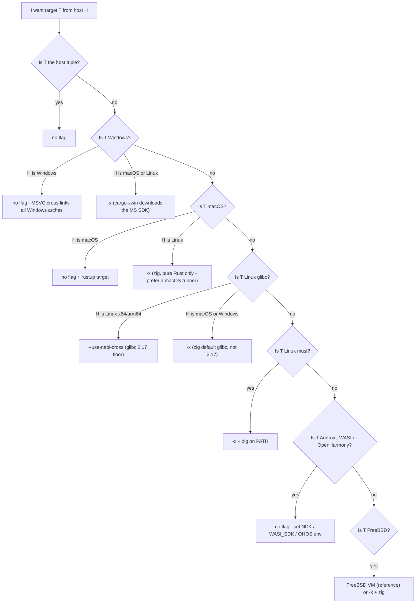

# Cross build

Cross-compiling a **NAPI-RS** addon means producing a `.node` binary for a target platform (say `aarch64-unknown-linux-gnu`) on a different host (say a Linux x64 CI runner). `napi build` supports this with two recommended mechanisms:

- **`--use-napi-cross`** for Linux glibc targets on a Linux x64/arm64 host — a gcc cross toolchain downloaded from npm, pinned to a glibc 2.17 floor.
- **`--cross-compile`** (**`-x`**) for Windows MSVC targets from a non-Windows host (`cargo-xwin` under the hood), and for musl — or glibc, macOS and FreeBSD targets when the options above are not available on your host — via `cargo-zigbuild`.

Android, WASI and OpenHarmony targets need no cross flag at all: the CLI configures their toolchains from platform environment variables (NDK / WASI SDK / OHOS SDK), with or without a cross flag — the [decision matrix](#decision-matrix) below carries the per-target detail. The zig/xwin toolchain is the default because it is much more lightweight than container-based cross-compilation ([napi-rs#491](https://github.com/napi-rs/napi-rs/issues/491)).

This page tells you which mechanism to use for your host/target pair, and how to deal with the two things that actually go wrong in practice: glibc versions and C/C++ dependencies. For what each flag does exactly — spawned commands, environment variables, combination rules — see the [`napi build` flag reference](./cli/build#cross-compilation-flags). The [cross-build demo project](https://github.com/napi-rs/cross-build) shows these mechanisms building addons for many platforms from a single Linux CI host.

## Decision matrix

The **Generated CI** column shows what the CI workflow scaffolded by `napi new` does for that target. It is the reference setup that is known to work — when in doubt, copy it.

| Target                                              | Generated CI (proof it works)               | From Linux x64/arm64              | From macOS        | From Windows      |
| --------------------------------------------------- | ------------------------------------------- | --------------------------------- | ----------------- | ----------------- |
| `x86_64-apple-darwin`                               | `macos-latest`, no flag                     | `-x` ¹                            | no flag           | not supported     |
| `aarch64-apple-darwin`                              | `macos-latest`, no flag (native)            | `-x` ¹                            | no flag           | not supported     |
| `x86_64-pc-windows-msvc`                            | `windows-latest`, no flag                   | `-x` ²                            | `-x` ²            | no flag           |
| `i686-pc-windows-msvc`                              | `windows-latest`, no flag                   | `-x` ²                            | `-x` ²            | no flag           |
| `aarch64-pc-windows-msvc`                           | `windows-latest` (x64), no flag             | `-x` ²                            | `-x` ²            | no flag           |
| `x86_64-unknown-linux-gnu`                          | `ubuntu-latest`, `--use-napi-cross`         | `--use-napi-cross`                | `-x` ³            | `-x` ³            |
| `aarch64-unknown-linux-gnu`                         | `ubuntu-latest`, `--use-napi-cross`         | `--use-napi-cross`                | `-x` ³            | `-x` ³            |
| `armv7-unknown-linux-gnueabihf`                     | `ubuntu-latest`, `--use-napi-cross`         | `--use-napi-cross`                | `-x` ³            | `-x` ³            |
| `x86_64-unknown-linux-musl`                         | `ubuntu-latest`, `-x` + zig setup step      | `-x` + zig                        | `-x` + zig        | `-x` + zig        |
| `aarch64-unknown-linux-musl`                        | `ubuntu-latest`, `-x` + zig setup step      | `-x` + zig                        | `-x` + zig        | `-x` + zig        |
| `aarch64-linux-android` / `armv7-linux-androideabi` | `ubuntu-latest`, no flag (preinstalled NDK) | no flag + NDK env                 | no flag + NDK env | no flag + NDK env |
| `wasm32-wasip1-threads`                             | `ubuntu-latest`, no flag                    | no flag                           | no flag           | no flag           |
| `x86_64-unknown-freebsd`                            | FreeBSD 15 VM job, no flag (native)         | `-x` + zig ⁴                      | `-x` + zig ⁴      | `-x` + zig ⁴      |
| `powerpc64le` / `s390x` `-unknown-linux-gnu`        | no generated job                            | `--use-napi-cross`                | —                 | —                 |
| `loongarch64` / `riscv64gc` `-unknown-linux-gnu`    | no generated job                            | no flag + a cross gcc you install | —                 | —                 |

Notes:

1. zig can link macOS binaries for **pure-Rust crates only** — dependencies that link Apple frameworks need a real macOS SDK (`SDKROOT`). Prefer a macOS runner.
2. cargo-xwin downloads the Microsoft CRT and Windows SDK itself; the Microsoft license applies. It needs `clang` installed (e.g. `brew install llvm` on macOS).
3. `--use-napi-cross` only works on Linux x64/arm64 hosts (the downloaded toolchain is a Linux binary), so from macOS or Windows use `-x` instead — but the glibc floor becomes zig's default, not 2.17. See [Glibc versions](#glibc-versions).
4. Under `-x`, FreeBSD routes through cargo-zigbuild like every other non-Windows target — napi-rs' own CI cross-builds `x86_64-unknown-freebsd` this way from `ubuntu-latest` (proven for Linux hosts; the tests still run in a FreeBSD VM). See the [FreeBSD recipe](#freebsd).

## Decision tree



The Windows branch routes by the target's _platform_, so `x86_64-pc-windows-gnu` lands in the xwin branch too — but cargo-xwin is MSVC-only, so `-x` does not actually work for that triple. Prefer the `*-pc-windows-msvc` triples, and if you really need windows-gnu, build it without a cross flag — see the windows-gnu note in [Recipes per target](#recipes-per-target).

## The three flags at a glance

|                        | `--use-napi-cross`                                                                                                                                                                                         | `--cross-compile` / `-x`                                                                                                                                                                                     | `--use-cross` (legacy)                                                          |
| ---------------------- | ---------------------------------------------------------------------------------------------------------------------------------------------------------------------------------------------------------- | ------------------------------------------------------------------------------------------------------------------------------------------------------------------------------------------------------------ | ------------------------------------------------------------------------------- |
| **Status**             | Recommended for Linux glibc targets                                                                                                                                                                        | Recommended for Windows MSVC targets from a non-Windows host and for musl; the zig fallback for glibc/macOS/FreeBSD when the preferred path is unavailable                                                   | **Legacy, not recommended**                                                     |
| **Mechanism**          | Env vars only: downloads a gcc cross toolchain from npm ([`@napi-rs/cross-toolchain`](https://github.com/napi-rs/cross-toolchain)) and points linker/CC/sysroot env at it; the command stays `cargo build` | Swaps the cargo subcommand: `cargo zigbuild` for most targets, `cargo xwin build` for Windows targets from a non-Windows host (routing covers every `*-windows-*` triple, but cargo-xwin supports MSVC only) | Swaps the binary: `cross build` runs the build inside a Docker/Podman container |
| **Targets**            | Exactly 5 Linux glibc triples: x64, arm64, armv7, ppc64le, s390x                                                                                                                                           | Linux (gnu and musl) and macOS targets via zig; Windows MSVC via xwin                                                                                                                                        | Whatever cross-rs has images for — Linux only, no macOS or Windows MSVC images  |
| **glibc floor**        | 2.17                                                                                                                                                                                                       | zig's default (2.28 for zig 0.12–0.14)                                                                                                                                                                       | The image's glibc (mostly 2.31; `:centos` variants 2.17)                        |
| **Prerequisites**      | Linux x64/arm64 host, `npm` on `PATH`; the toolchain is downloaded and cached automatically                                                                                                                | `zig` on `PATH` for the zigbuild path, `clang` for the xwin path (the CLI never installs or checks either); the selected helper (cargo-zigbuild or cargo-xwin) is auto-installed on first use                | `cross` installed manually, plus a running Docker >= 20.10 or Podman >= 3.4     |
| **C/C++ dependencies** | Compiled with the bundled gcc; the aarch64 gcc is old — see [known limitation](#native-dependencies)                                                                                                       | Compiled with `zig cc`; Apple-framework dependencies need a macOS SDK                                                                                                                                        | Full container toolchain — last resort for autotools/CMake build scripts        |

Pick exactly one flag per build — they do not combine, and two of the combinations misbehave despite a reassuring warning. See [the combination rules](./cli/build#pick-exactly-one).

## Recipes per target

Whatever mechanism you pick, the target's Rust standard library must be installed first: `rustup target add <triple>`. Each recipe ends with one copy-paste command and names the generated-CI job that runs the same thing.

### Linux glibc (x64, arm64, armv7)

From a Linux x64/arm64 host, use `--use-napi-cross`: it builds against glibc 2.17, so the binary loads on virtually every glibc distro. From macOS or Windows, use `-x` instead (zig runs on both) — at the cost of zig's higher default glibc floor.

```sh
napi build --release --target aarch64-unknown-linux-gnu --use-napi-cross
```

Proof: the generated CI builds `x86_64-unknown-linux-gnu`, `aarch64-unknown-linux-gnu` and `armv7-unknown-linux-gnueabihf` on `ubuntu-latest` with exactly this flag.

### Linux musl (x64, arm64)

Use `-x` from any host, with `zig` installed and on `PATH`. The CLI automatically appends `-C target-feature=-crt-static` to `RUSTFLAGS` for musl targets. Do not reach for musl to fix a `GLIBC_x.yy not found` error — that is a glibc-floor problem, see [Glibc versions](#glibc-versions).

```sh
napi build --release --target aarch64-unknown-linux-musl --cross-compile
```

Proof: the generated CI builds both musl targets on `ubuntu-latest` with `-x`, preceded by a setup-zig step.

### Windows (MSVC) from macOS or Linux

Use `-x`: the build goes through cargo-xwin, which downloads the Microsoft CRT and Windows SDK itself (the Microsoft license applies). You need `clang` installed (`apt install clang` / `brew install llvm`). For `i686`, the CLI sets `XWIN_ARCH=x86` automatically. On a Windows host no flag is needed at all — MSVC cross-links x64, x86 and arm64 natively.

```sh
napi build --release --target x86_64-pc-windows-msvc --cross-compile
```

Proof: the generated CI builds all three MSVC targets on `windows-latest` with no flag; `-x` is the path when you have no Windows runner.

What about `*-pc-windows-gnu`? `x86_64-pc-windows-gnu` is an accepted CLI target since [napi-rs#2935](https://github.com/napi-rs/napi-rs/pull/2935) (the generated JS loader picks the `win32-x64-gnu` binary when Node itself is a MINGW build); the other windows-gnu arches are not accepted. Do **not** use `-x` for it: cargo-xwin supports MSVC triples only, so for windows-gnu it configures nothing and the build dies later with the cryptic ``error: linker `x86_64-w64-mingw32-gcc` not found`` (upcoming CLI releases reject the combination upfront). The recipe that works uses no cross flag at all: `rustup target add x86_64-pc-windows-gnu`, install a mingw-w64 toolchain (`apt install mingw-w64` / `brew install mingw-w64`), and set `LIBNODE_PATH` to a directory containing `libnode.dll` from MSYS2's Node — napi-build links windows-gnu addons directly against it. In practice this target is built inside MSYS2/MINGW, where both prerequisites come for free. There are still no official Node.js windows-gnu builds, so unless you specifically target MSYS2/MINGW Node, build for the `*-pc-windows-msvc` triple instead — historical context in [napi-rs#2001](https://github.com/napi-rs/napi-rs/issues/2001).

### macOS

On a macOS host, no cross flag is needed — add the other architecture with `rustup target add` and build. The generated CI also sets `MACOSX_DEPLOYMENT_TARGET: '10.13'` to pin the minimum macOS version. From Linux, `-x` works for pure-Rust crates only: dependencies that link Apple frameworks need a real macOS SDK (`SDKROOT`), so prefer a macOS runner. Building macOS targets from Windows is not supported.

```sh
napi build --release --target aarch64-apple-darwin
```

Proof: the generated CI builds both darwin targets natively on `macos-latest` with no flag.

### Android

No cross flag. The CLI configures the toolchain from the `ANDROID_NDK_LATEST_HOME` environment variable (preinstalled on GitHub `ubuntu-latest` runners) — always, whether or not any cross flag is passed.

```sh
napi build --release --target aarch64-linux-android
```

Proof: the generated CI builds `aarch64-linux-android` and `armv7-linux-androideabi` on `ubuntu-latest` with no flag.

### WASI

No cross flag. Linking is handled by rustup's bundled `rust-lld`. `WASI_SDK_PATH` is optional — but if set, it must point to an existing directory, and the CLI reads it whether or not any cross flag is passed.

```sh
napi build --release --target wasm32-wasip1-threads
```

Proof: the generated CI builds `wasm32-wasip1-threads` on `ubuntu-latest` with no flag.

### FreeBSD

Two working setups. The reference path is the generated CI's: build natively inside a FreeBSD 15 VM (via `cross-platform-actions/action`) on an `ubuntu-latest` runner — no cross flag. The generated job only builds and uploads the artifact; if you want your tests to run on FreeBSD too, add that step to the VM script yourself. But FreeBSD can also be cross-compiled: under `-x` it routes through cargo-zigbuild like every other non-Windows target, and napi-rs' own CI builds `x86_64-unknown-freebsd` exactly this way — on `ubuntu-latest` with zig installed — before running the tests inside a FreeBSD VM. The usual zig caveats apply: C/C++ dependencies are compiled by `zig cc` (see [Native dependencies](#native-dependencies)).

```sh
napi build --release --target x86_64-unknown-freebsd --cross-compile
```

Proof: the generated CI builds natively in the FreeBSD 15 VM; the `-x` command above is what napi-rs' own test workflow runs on Linux.

## Glibc versions

A `*-linux-gnu` binary links glibc dynamically, and at load time it requires at least the glibc version it was built against. **Your binary inherits the build host's glibc as its floor**: build on a bleeding-edge distro without a cross flag, and users on older distros get:

```
Error: /lib/x86_64-linux-gnu/libc.so.6: version `GLIBC_2.38' not found
```

This error means: build against an older glibc. It does **not** mean: switch to a musl target.

- `--use-napi-cross` pins the floor to **glibc 2.17** (manylinux2014 lineage) regardless of the host distro.
- `-x` builds against **zig's default glibc** — 2.28 for zig 0.12–0.14 — not 2.17.
- Pinning an explicit version by suffixing the triple (`--target aarch64-unknown-linux-gnu.2.17`) is **not supported yet**: the suffix breaks the CLI's artifact lookup. Watch [napi-rs#3176](https://github.com/napi-rs/napi-rs/issues/3176).

## Verify the artifact

Before publishing, check that the binary is the architecture you intended and requires no more glibc than you targeted:

```sh
# CPU architecture and file format
file my-package.linux-arm64-gnu.node

# Highest glibc symbol version the binary requires
objdump -T my-package.linux-arm64-gnu.node | grep -o 'GLIBC_[0-9.]*' | sort -Vu | tail -1
```

Expect at most `GLIBC_2.17` when built with `--use-napi-cross`, and zig's default when built with `-x`.

## Native dependencies

C/C++ dependencies are the recurring wall in cross-compilation: crates like `ring`, `openssl-sys` or `zstd-sys` compile C source via a build script, which needs a C compiler that targets your _target_ — configuring rustc alone is not enough.

- **cc-based crates (`ring`, etc.)**: set `TARGET_CC=clang` — clang is inherently a cross compiler. `TARGET_CC` outranks `CC` since `@napi-rs/cli` 3.0.0-alpha.92.

  ```sh
  TARGET_CC=clang napi build --release --target aarch64-unknown-linux-gnu --use-napi-cross
  ```

- **Known limitation — `aws-lc-sys`**: the default rustls backend (pulled in transitively by `reqwest`, `hyper-rustls`, etc.) fails to build with `--use-napi-cross` for aarch64, because the bundled gcc is too old ([cross-toolchain#4](https://github.com/napi-rs/cross-toolchain/issues/4)). Work around it with `TARGET_CC=clang`, or use `-x` instead.
- **TLS / OpenSSL**: prefer rustls with the `ring` backend, or enable the `vendored` feature of `openssl-sys` so OpenSSL is compiled from source with the cross toolchain instead of linking host libraries.
- **Last resort**: dependencies whose build scripts run autotools or CMake and pick up host binutils may only build in the legacy container path (`--use-cross`), where the entire toolchain matches the target.

## Docker images are deprecated

::: warning
The prebuilt Docker images (`ghcr.io/napi-rs/napi-rs/nodejs-rust:*`) and the
`*.Dockerfile` based builds are **deprecated**. Migrate to
`--use-napi-cross` (Linux glibc targets) or `-x` (musl targets)
on a plain `ubuntu-latest` runner.

:::

| Old image (`ghcr.io/napi-rs/napi-rs/...`)       | New setup on plain `ubuntu-latest`                                                                                              |
| ----------------------------------------------- | ------------------------------------------------------------------------------------------------------------------------------- |
| `nodejs-rust:lts-debian`                        | `napi build --release --target x86_64-unknown-linux-gnu --use-napi-cross` — the same glibc 2.17 floor the Debian image provided |
| `nodejs-rust:lts-debian-aarch64`                | `napi build --release --target aarch64-unknown-linux-gnu --use-napi-cross`                                                      |
| `nodejs-rust:lts-alpine`                        | install zig, then `napi build --release --target x86_64-unknown-linux-musl -x`                                                  |
| `nodejs-rust:lts-debian-zig` / `lts-alpine-zig` | install zig, then `napi build --release --target <triple> -x`                                                                   |

Still on the images? Two rules: run plain `napi build --target <triple>` inside them with **no cross flags** — the image already pins the toolchain and glibc, and stacking cross flags on top is what breaks; and pin the image by digest (`nodejs-rust@sha256:...`), because the `lts-*` tags mutate over time.

## Add a target to an existing project

1. Add the triple to `targets` in your `napi` config (see [napi config](./cli/napi-config)).
2. Run `napi create-npm-dirs` to scaffold the per-platform npm packages.
3. Add a CI matrix entry for the target — copy the closest job from the generated CI (the [decision matrix](#decision-matrix) tells you the runner and flag).
4. After upgrading `@napi-rs/cli` — especially across major versions — regenerate your CI workflow from a fresh `napi new` scaffold rather than patching it, so it does not drift from what the CLI expects.

## See also

- [`napi build` cross-compilation flag reference](./cli/build#cross-compilation-flags) — exact commands, environment variable contract, combination rules
- [FAQ: Build for Linux alpine](./more/faq#build-for-linux-alpine) — musl specifics

## Sponsor our team

https://github.com/sponsors/napi-rs/

Integrating and properly configuring cross-platform compilation toolchain in the open source community can be very tedious and labor-intensive. Understanding these compilation parameters and resolving potential bugs can be very time-consuming and difficult to test.
Special thanks for our team member [@messense](https://github.com/messense) who has been working on `cargo-xwin` and `cargo-zigbuild` which is enabled us to build Windows native addons on non-Windows systems.

If you are using **NAPI-RS** in your company, please consider sponsoring our team to support the development of NAPI-RS. We will be very grateful for your support.
