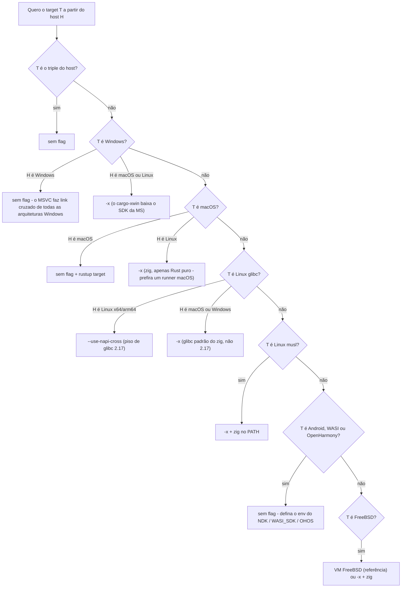

# Compilação cruzada

Compilar de forma cruzada um complemento (addon) **NAPI-RS** significa produzir um binário `.node` para uma plataforma-alvo (digamos `aarch64-unknown-linux-gnu`) em um host diferente (digamos um runner de CI Linux x64). O `napi build` suporta isso com dois mecanismos recomendados:

- **`--use-napi-cross`** para targets Linux glibc em um host Linux x64/arm64 — uma toolchain cruzada gcc baixada do npm, fixada em um piso de glibc 2.17.
- **`--cross-compile`** (**`-x`**) para targets Windows MSVC a partir de um host não-Windows (via `cargo-xwin`) e para targets musl (via `cargo-zigbuild`). Ele também cobre targets glibc, macOS e FreeBSD através do `cargo-zigbuild` quando `--use-napi-cross` ou um runner nativo não está disponível no seu host.

Targets Android, WASI e OpenHarmony não precisam de nenhuma flag de cross: a CLI configura as toolchains deles a partir de variáveis de ambiente da plataforma (NDK / WASI SDK / OHOS SDK), independentemente de qual flag de cross for passada (se houver). A [matriz de decisão](#matriz-de-decis%C3%A3o) abaixo tem o detalhe por target. O NAPI-RS padronizou nas toolchains zig/xwin porque elas são muito mais leves do que a compilação cruzada baseada em contêineres ([napi-rs#491](https://github.com/napi-rs/napi-rs/issues/491)).

Esta página diz qual mecanismo usar para o seu par host/target e como lidar com as duas coisas que mais dão errado: versões de glibc e dependências C/C++. Para o que cada flag faz exatamente — comandos executados, variáveis de ambiente, regras de combinação — veja a [referência de flags do `napi build`](./cli/build#flags-de-compila%C3%A7%C3%A3o-cruzada). O [projeto de demonstração cross-build](https://github.com/napi-rs/cross-build) mostra esses mecanismos compilando addons para muitas plataformas a partir de um único host de CI Linux.

## Matriz de decisão

A coluna **CI gerada** mostra o que o workflow de CI gerado pelo `napi new` faz para aquele target. É a configuração de referência comprovadamente funcional — na dúvida, copie-a.

| Target                                              | CI gerada (configuração de referência)        | A partir de Linux x64/arm64                | A partir de macOS     | A partir de Windows   |
| --------------------------------------------------- | --------------------------------------------- | ------------------------------------------ | --------------------- | --------------------- |
| `x86_64-apple-darwin`                               | `macos-latest`, sem flag                      | `-x`¹                                      | sem flag              | não suportado         |
| `aarch64-apple-darwin`                              | `macos-latest`, sem flag (nativo)             | `-x`¹                                      | sem flag              | não suportado         |
| `x86_64-pc-windows-msvc`                            | `windows-latest`, sem flag                    | `-x`²                                      | `-x`²                 | sem flag              |
| `i686-pc-windows-msvc`                              | `windows-latest`, sem flag                    | `-x`²                                      | `-x`²                 | sem flag              |
| `aarch64-pc-windows-msvc`                           | `windows-latest` (x64), sem flag              | `-x`²                                      | `-x`²                 | sem flag              |
| `x86_64-unknown-linux-gnu`                          | `ubuntu-latest`, `--use-napi-cross`           | `--use-napi-cross`                         | `-x`³                 | `-x`³                 |
| `aarch64-unknown-linux-gnu`                         | `ubuntu-latest`, `--use-napi-cross`           | `--use-napi-cross`                         | `-x`³                 | `-x`³                 |
| `armv7-unknown-linux-gnueabihf`                     | `ubuntu-latest`, `--use-napi-cross`           | `--use-napi-cross`                         | `-x`³                 | `-x`³                 |
| `x86_64-unknown-linux-musl`                         | `ubuntu-latest`, `-x` + etapa de setup do zig | `-x` + zig                                 | `-x` + zig            | `-x` + zig            |
| `aarch64-unknown-linux-musl`                        | `ubuntu-latest`, `-x` + etapa de setup do zig | `-x` + zig                                 | `-x` + zig            | `-x` + zig            |
| `aarch64-linux-android` / `armv7-linux-androideabi` | `ubuntu-latest`, sem flag (NDK pré-instalado) | sem flag + env do NDK                      | sem flag + env do NDK | sem flag + env do NDK |
| `wasm32-wasip1-threads`                             | `ubuntu-latest`, sem flag                     | sem flag                                   | sem flag              | sem flag              |
| `x86_64-unknown-freebsd`                            | job em VM FreeBSD 15, sem flag (nativo)       | `-x` + zig⁴                                | `-x` + zig⁴           | `-x` + zig⁴           |
| `powerpc64le` / `s390x` `-unknown-linux-gnu`        | nenhum job gerado                             | `--use-napi-cross`                         | —                     | —                     |
| `loongarch64` / `riscv64gc` `-unknown-linux-gnu`    | nenhum job gerado                             | sem flag + um gcc cruzado que você instala | —                     | —                     |

Notas:

1. o zig consegue linkar binários macOS **apenas para crates Rust puros** — dependências que linkam frameworks da Apple precisam de um SDK macOS real (`SDKROOT`). Prefira um runner macOS.
2. o cargo-xwin baixa por conta própria a CRT da Microsoft e o SDK do Windows; a licença da Microsoft se aplica. Ele precisa do `clang` instalado (por exemplo, `brew install llvm` no macOS).
3. `--use-napi-cross` só funciona em hosts Linux x64/arm64 (a toolchain baixada é um binário Linux); portanto, a partir de macOS ou Windows use `-x` — mas o piso de glibc passa a ser o padrão do zig, não 2.17. Veja [Versões de glibc](#vers%C3%B5es-de-glibc).
4. Sob `-x`, o FreeBSD passa pelo cargo-zigbuild como qualquer outro target não-Windows — tenha o `zig` no `PATH`; hosts Linux são a rota mais comprovada na prática. Se você quiser que seus testes também rodem no FreeBSD, execute-os em uma VM FreeBSD. Veja a [receita do FreeBSD](#freebsd).

## Árvore de decisão



O ramo do Windows roteia pela _plataforma_ do target, então `x86_64-pc-windows-gnu` também cai no ramo do xwin — mas o cargo-xwin é somente MSVC, e `-x` falha para esse triple. Prefira os triples `*-pc-windows-msvc`; se você precisa de windows-gnu, compile-o sem flag de cross — veja a nota sobre windows-gnu em [Receitas por target](#receitas-por-target).

## As três flags em resumo

|                        | `--use-napi-cross`                                                                                                                                                                                                                    | `--cross-compile` / `-x`                                                                                                                                                                                                                    | `--use-cross` (legada)                                                                     |
| ---------------------- | ------------------------------------------------------------------------------------------------------------------------------------------------------------------------------------------------------------------------------------- | ------------------------------------------------------------------------------------------------------------------------------------------------------------------------------------------------------------------------------------------- | ------------------------------------------------------------------------------------------ |
| **Status**             | Recomendada para targets Linux glibc                                                                                                                                                                                                  | Recomendada para targets Windows MSVC a partir de um host não-Windows e para musl; o fallback via zig para glibc/macOS/FreeBSD quando o caminho preferido não está disponível                                                               | **Legada, não recomendada**                                                                |
| **Mecanismo**          | Apenas variáveis de ambiente: baixa uma toolchain cruzada gcc do npm ([`@napi-rs/cross-toolchain`](https://github.com/napi-rs/cross-toolchain)) e aponta as env de linker/CC/sysroot para ela; o comando continua sendo `cargo build` | Troca o subcomando do cargo: `cargo zigbuild` para a maioria dos targets, `cargo xwin build` para targets Windows a partir de um host não-Windows (o roteamento cobre todo triple `*-windows-*`, mas o cargo-xwin suporta apenas MSVC)      | Troca o binário: `cross build` executa a compilação dentro de um contêiner Docker/Podman   |
| **Targets**            | Cinco triples Linux glibc: x64, arm64, armv7, ppc64le, s390x                                                                                                                                                                          | Targets Linux (gnu e musl) e macOS via zig; Windows MSVC via xwin                                                                                                                                                                           | O que o cross-rs tiver imagens para — apenas Linux, sem imagens para macOS ou Windows MSVC |
| **Piso de glibc**      | 2.17                                                                                                                                                                                                                                  | O padrão do zig (2.28 para zig 0.12–0.14)                                                                                                                                                                                                   | A glibc da imagem (majoritariamente 2.31; variantes `:centos` 2.17)                        |
| **Pré-requisitos**     | Host Linux x64/arm64, `npm` no `PATH`; a toolchain é baixada e cacheada automaticamente                                                                                                                                               | `zig` no `PATH` para o caminho do zigbuild, `clang` para o caminho do xwin (a CLI nunca instala nem verifica nenhum dos dois); o subcomando do cargo selecionado (cargo-zigbuild ou cargo-xwin) é instalado automaticamente no primeiro uso | `cross` instalado manualmente, mais um Docker >= 20.10 ou Podman >= 3.4 em execução        |
| **Dependências C/C++** | Compiladas com o gcc embutido; o gcc de aarch64 é antigo — veja a [limitação conhecida](#depend%C3%AAncias-nativas)                                                                                                                   | Compiladas com `zig cc`; dependências de frameworks da Apple precisam de um SDK macOS                                                                                                                                                       | Toolchain completa do contêiner — último recurso para build scripts com autotools/CMake    |

Escolha exatamente uma flag por build. As flags não se combinam, nem mesmo nas combinações que apenas imprimem um aviso — veja [as regras de combinação](./cli/build#escolha-exatamente-uma).

## Receitas por target

Seja qual for o mecanismo escolhido, a biblioteca padrão do Rust para o target precisa estar instalada primeiro: `rustup target add <triple>`. Cada receita termina com um comando de copiar e colar e uma nota sobre como a CI gerada compila o mesmo target.

### Linux glibc (x64, arm64, armv7)

A partir de um host Linux x64/arm64, use `--use-napi-cross`: ele compila contra a glibc 2.17, então o binário carrega em praticamente qualquer distro glibc. A partir de macOS ou Windows, use `-x` (o zig roda em ambos) — ao custo do piso de glibc padrão do zig, que é mais alto.

```sh
napi build --release --target aarch64-unknown-linux-gnu --use-napi-cross
```

A CI gerada compila `x86_64-unknown-linux-gnu`, `aarch64-unknown-linux-gnu` e `armv7-unknown-linux-gnueabihf` no `ubuntu-latest` com exatamente essa flag.

### Linux musl (x64, arm64)

Use `-x` a partir de qualquer host, com o `zig` instalado e no `PATH`. A CLI adiciona automaticamente `-C target-feature=-crt-static` ao `RUSTFLAGS` para targets musl. Não recorra ao musl para consertar um erro `GLIBC_x.yy not found` — isso é um problema de piso de glibc, veja [Versões de glibc](#vers%C3%B5es-de-glibc).

```sh
napi build --release --target aarch64-unknown-linux-musl --cross-compile
```

A CI gerada compila os dois targets musl no `ubuntu-latest` com `-x`, depois de uma etapa setup-zig.

### Windows (MSVC) a partir de macOS ou Linux

Use `-x`: a compilação passa pelo cargo-xwin, que baixa por conta própria a CRT da Microsoft e o SDK do Windows (a licença da Microsoft se aplica). Você precisa do `clang` instalado (`apt install clang` / `brew install llvm`). Para `i686`, a CLI define `XWIN_ARCH=x86` automaticamente. Em um host Windows nenhuma flag é necessária — o MSVC faz link cruzado de x64, x86 e arm64 nativamente.

```sh
napi build --release --target x86_64-pc-windows-msvc --cross-compile
```

A CI gerada compila os três targets MSVC no `windows-latest` sem flag; use `-x` quando você não tiver um runner Windows.

E quanto a `*-pc-windows-gnu`? `x86_64-pc-windows-gnu` é um target aceito pela CLI desde [napi-rs#2935](https://github.com/napi-rs/napi-rs/pull/2935) (o loader JS gerado escolhe o binário `win32-x64-gnu` quando o próprio Node é um build MINGW); as outras arquiteturas windows-gnu não são aceitas. **Não** use `-x` para ele: o cargo-xwin suporta apenas triples MSVC, então para windows-gnu ele não configura nada e a compilação falha mais tarde com ``error: linker `x86_64-w64-mingw32-gcc` not found``. Em vez disso, compile-o sem flag de cross: `rustup target add x86_64-pc-windows-gnu`, instale uma toolchain mingw-w64 (`apt install mingw-w64` / `brew install mingw-w64`) e defina `LIBNODE_PATH` para um diretório contendo o `libnode.dll` do Node do MSYS2 — o napi-build linka addons windows-gnu diretamente contra ele. Esse target normalmente é compilado dentro do MSYS2/MINGW, onde os dois pré-requisitos já estão disponíveis. Ainda não existem builds oficiais do Node.js para windows-gnu, então, a menos que você mire especificamente o Node do MSYS2/MINGW, compile para o triple `*-pc-windows-msvc` — contexto histórico em [napi-rs#2001](https://github.com/napi-rs/napi-rs/issues/2001).

### macOS

Em um host macOS, nenhuma flag de cross é necessária — adicione a outra arquitetura com `rustup target add` e compile. A CI gerada também define `MACOSX_DEPLOYMENT_TARGET: '10.13'` para fixar a versão mínima do macOS. A partir do Linux, `-x` funciona apenas para crates Rust puros: dependências que linkam frameworks da Apple precisam de um SDK macOS real (`SDKROOT`), então prefira um runner macOS. Compilar targets macOS a partir do Windows não é suportado.

```sh
napi build --release --target aarch64-apple-darwin
```

A CI gerada compila os dois targets darwin nativamente no `macos-latest` sem flag.

### Android

Sem flag de cross. A CLI configura a toolchain a partir da variável de ambiente `ANDROID_NDK_LATEST_HOME` (pré-instalada nos runners `ubuntu-latest` do GitHub), seja uma flag de cross passada ou não.

```sh
napi build --release --target aarch64-linux-android
```

A CI gerada compila `aarch64-linux-android` e `armv7-linux-androideabi` no `ubuntu-latest` sem flag.

### WASI

Sem flag de cross. O link é feito pelo `rust-lld` que acompanha o rustup. `WASI_SDK_PATH` é opcional — mas, se definida, precisa apontar para um diretório existente — e a CLI a lê seja uma flag de cross passada ou não.

```sh
napi build --release --target wasm32-wasip1-threads
```

A CI gerada já compila `wasm32-wasip1-threads` no `ubuntu-latest` — nenhuma flag necessária.

### FreeBSD

Há duas configurações que funcionam. A configuração de referência é a da CI gerada: compilar nativamente dentro de uma VM FreeBSD 15 (via `cross-platform-actions/action`) em um runner `ubuntu-latest` — sem flag de cross. O job gerado apenas compila e faz upload do artefato; se você quiser que seus testes também rodem no FreeBSD, adicione essa etapa ao script da VM você mesmo. O FreeBSD também pode ser compilado de forma cruzada a partir do Linux: sob `-x` ele passa pelo cargo-zigbuild como qualquer outro target não-Windows — execute em um host Linux com o zig instalado. As ressalvas usuais do zig se aplicam: dependências C/C++ são compiladas pelo `zig cc` (veja [Dependências nativas](#depend%C3%AAncias-nativas)).

```sh
napi build --release --target x86_64-unknown-freebsd --cross-compile
```

A CI gerada compila nativamente na VM FreeBSD 15; o comando `-x` acima é a alternativa de compilação cruzada a partir de um host Linux.

## Versões de glibc

Um binário `*-linux-gnu` linka a glibc dinamicamente e, na hora de carregar, exige pelo menos a versão de glibc contra a qual foi compilado. **Seu binário herda a glibc do host de build como piso**: compile em uma distro recente sem flag de cross, e os usuários em distros mais antigas recebem:

```
Error: /lib/x86_64-linux-gnu/libc.so.6: version `GLIBC_2.38' not found
```

Esse erro significa: compile contra uma glibc mais antiga. Ele **não** significa: mude para um target musl.

- `--use-napi-cross` fixa o piso na **glibc 2.17** (linhagem manylinux2014), independentemente da distro do host.
- `-x` compila contra a **glibc padrão do zig** — 2.28 para zig 0.12–0.14 — e não 2.17.
- Fixar uma versão explícita com um sufixo no triple (`--target aarch64-unknown-linux-gnu.2.17`) **ainda não é suportado**: o sufixo quebra a busca de artefatos da CLI. Acompanhe [napi-rs#3176](https://github.com/napi-rs/napi-rs/issues/3176).

## Verifique o artefato

Antes de publicar, confira se o binário é da arquitetura pretendida e não exige mais glibc do que você mirou:

```sh
# CPU architecture and file format
file my-package.linux-arm64-gnu.node

# Highest glibc symbol version the binary requires
objdump -T my-package.linux-arm64-gnu.node | grep -o 'GLIBC_[0-9.]*' | sort -Vu | tail -1
```

Espere no máximo `GLIBC_2.17` quando compilado com `--use-napi-cross`, e o padrão do zig quando compilado com `-x`.

## Dependências nativas

Dependências C/C++ são o obstáculo mais comum na compilação cruzada: crates como `ring`, `openssl-sys` ou `zstd-sys` compilam código C via build script, que precisa de um compilador C que mire o seu _target_ — configurar apenas o rustc não é suficiente.

- **Crates baseados em cc (`ring`, etc.)**: defina `TARGET_CC=clang` — o clang é inerentemente um compilador cruzado. `TARGET_CC` tem precedência sobre `CC` (desde `@napi-rs/cli` 3.0.0-alpha.92).

  ```sh
  TARGET_CC=clang napi build --release --target aarch64-unknown-linux-gnu --use-napi-cross
  ```

- **Limitação conhecida — `aws-lc-sys`**: o backend padrão do rustls (trazido transitivamente por `reqwest`, `hyper-rustls`, etc.) falha ao compilar com `--use-napi-cross` para aarch64, porque o gcc embutido é antigo demais ([cross-toolchain#4](https://github.com/napi-rs/cross-toolchain/issues/4)). Contorne com `TARGET_CC=clang` ou use `-x` no lugar.
- **TLS / OpenSSL**: prefira rustls com o backend `ring`, ou habilite a feature `vendored` do `openssl-sys` para que o OpenSSL seja compilado a partir do código-fonte com a toolchain cruzada em vez de linkar bibliotecas do host.
- **Último recurso**: dependências cujos build scripts rodam autotools ou CMake e capturam binutils do host podem só compilar no caminho legado com contêiner (`--use-cross`), onde a toolchain inteira corresponde ao target.

## As imagens Docker estão descontinuadas

::: warning
As imagens Docker pré-construídas (`ghcr.io/napi-rs/napi-rs/nodejs-rust:*`) e
as builds baseadas em `*.Dockerfile` estão **descontinuadas**. Migre para
`--use-napi-cross` (targets Linux glibc) ou `-x` (targets musl)
em um runner `ubuntu-latest` comum.

:::

| Imagem antiga (`ghcr.io/napi-rs/napi-rs/...`)   | Nova configuração em um `ubuntu-latest` comum                                                                                       |
| ----------------------------------------------- | ----------------------------------------------------------------------------------------------------------------------------------- |
| `nodejs-rust:lts-debian`                        | `napi build --release --target x86_64-unknown-linux-gnu --use-napi-cross` — o mesmo piso de glibc 2.17 que a imagem Debian fornecia |
| `nodejs-rust:lts-debian-aarch64`                | `napi build --release --target aarch64-unknown-linux-gnu --use-napi-cross`                                                          |
| `nodejs-rust:lts-alpine`                        | instale o zig e então `napi build --release --target x86_64-unknown-linux-musl -x`                                                  |
| `nodejs-rust:lts-debian-zig` / `lts-alpine-zig` | instale o zig e então `napi build --release --target <triple> -x`                                                                   |

Se você ainda usa as imagens, siga duas regras. Primeiro, rode um `napi build --target <triple>` puro dentro delas, **sem flags de cross** — a imagem já fixa a toolchain e a glibc, e adicionar flags de cross por cima disso é o que quebra as builds. Segundo, fixe a imagem por digest (`nodejs-rust@sha256:...`), porque as tags `lts-*` mudam com o tempo.

## Adicionar um target a um projeto existente

1. Adicione o triple a `targets` na sua configuração `napi` (veja [napi config](./cli/napi-config)).
2. Execute `napi create-npm-dirs` para gerar a estrutura dos pacotes npm por plataforma.
3. Adicione uma entrada na matriz de CI para o target — copie o job mais próximo da CI gerada (a [matriz de decisão](#matriz-de-decis%C3%A3o) diz o runner e a flag).
4. Depois de atualizar o `@napi-rs/cli` — especialmente entre versões major — gere novamente o seu workflow de CI a partir de um scaffold novo do `napi new` em vez de remendá-lo, para que ele não se desvie do que a CLI espera.

## Veja também

- [Referência de flags de compilação cruzada do `napi build`](./cli/build#flags-de-compila%C3%A7%C3%A3o-cruzada) — comandos exatos, contrato de variáveis de ambiente, regras de combinação
- [FAQ: Compilar para Linux alpine](./more/faq#compilar-para-linux-alpine) — especificidades do musl

## Patrocine nossa equipe

https://github.com/sponsors/napi-rs/

Integrar e configurar corretamente toolchains de compilação multiplataforma na comunidade open source pode ser muito tedioso e trabalhoso. Entender esses parâmetros de compilação e resolver bugs potenciais pode consumir muito tempo e ser difícil de testar.
Agradecimentos especiais ao membro da nossa equipe [@messense](https://github.com/messense), que vem trabalhando no `cargo-xwin` e no `cargo-zigbuild`, o que nos permitiu compilar addons nativos do Windows em sistemas não-Windows.

Se você usa o **NAPI-RS** na sua empresa, considere patrocinar nossa equipe para apoiar o desenvolvimento do NAPI-RS. Ficaremos muito gratos pelo seu apoio.
