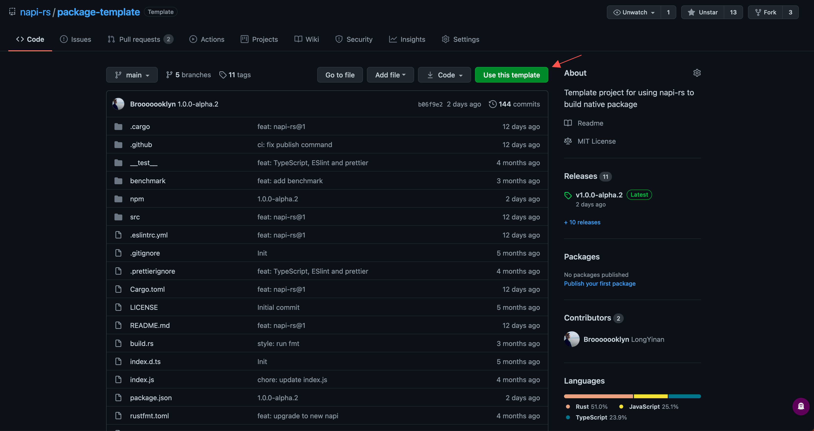

# Começando

import Video from '@/public/assets/napi-rs-guide.mp4'

## Comece com `@napi-rs/cli`

> A Maneira recomendada.

<br />

<video controls style={{ width: '100%' }}>
  <source src={Video} type="video/mp4" />
  <track kind="captions" srcLang="en" />
</video>

### Instale a cli

```bash
yarn global add @napi-rs/cli
# or
npm install -g @napi-rs/cli
# or
pnpm add -g @napi-rs/cli
```

### Crie um projeto

```bash
napi new
```

#### Nome do pacote

O campo name no `package.json`.

#### Escolha os alvos que deseja suportar

Plataformas que você desejar dar suporte.

#### Habilite GitHub actions

Gere a configuração do GitHub actions para você.

### Aprofundamento

Aqui é recomendado distribuir seu pacote sob [escopo npm](https://docs.npmjs.com/creating-and-publishing-scoped-public-packages/) porque `@napi-rs/cli` por padrão, anexa os diferentes sufixos de plataforma ao nome do pacote npm como o nome do pacote para a distribuição binária de plataforma diferente. O uso do escopo npm reduzirá a chance de o nome do pacote já estar em uso.

Por exemplo, se você quiser publicar o pacote `@cool/core`, com suporte para `macOS x64`, `Windows x64` e `Linux aarch64`, o `@napi-rs/cli` criará e publicará quatro pacotes para você:

- `@cool/core` inclue apenas códigos `JavaScript`, que na verdade carregam o binário nativo de cada plataforma.
- `@cool/core-darwin-x64` para a plataforma `macOS x64`.
- `@cool/core-win32-x64` para a plataforma `Windows x64`.
- `@cool/core-linux-arm64-gnu` para a plataforma `Linux aarch64`.

Em cada pacote binário de plataforma, há os campos `cpu` e `os` em seu `package.json`:

```json filename="package.json"
{
  "name": "@cool/core-darwin-x64",
  "version": "1.0.0",
  "os": ["darwin"],
  "cpu": ["x64"]
}
```

E `@cool/core` utiliza esses pacotes nativos como `optionalDependencies`:

```json filename="package.json"
{
  "name": "@cool/core",
  "version": "1.0.0",
  "optionalDependencies": {
    "@cool/core-darwin-x64": "^1.0.0",
    "@cool/core-win32-x64": "^1.0.0",
    "@cool/core-linux-arm64": "^1.0.0"
  }
}
```

E seu `index.js` em `@cool/core` será isso:

```js filename="index.js"
const { existsSync, readFileSync } = require('fs')
const { join } = require('path')

const { platform, arch } = process

let nativeBinding = null
let localFileExisted = false
let isMusl = false
let loadError = null

switch (platform) {
  case 'darwin':
    switch (arch) {
      case 'x64':
        localFileExisted = existsSync(join(__dirname, 'core.darwin-x64.node'))
        try {
          if (localFileExisted) {
            nativeBinding = require('./core.darwin-x64.node')
          } else {
            nativeBinding = require('@cool/core-darwin-x64')
          }
        } catch (e) {
          loadError = e
        }
        break
      case 'arm64':
        localFileExisted = existsSync(join(__dirname, 'core.darwin-arm64.node'))
        try {
          if (localFileExisted) {
            nativeBinding = require('./core.darwin-arm64.node')
          } else {
            nativeBinding = require('@cool/core-darwin-arm64')
          }
        } catch (e) {
          loadError = e
        }
        break
      default:
        throw new Error(`Unsupported architecture on macOS: ${arch}`)
    }
    break
  // ...
  default:
    throw new Error(`Unsupported OS: ${platform}, architecture: ${arch}`)
}

if (!nativeBinding) {
  if (loadError) {
    throw loadError
  }
  throw new Error(`Failed to load native binding`)
}

const { plus100 } = nativeBinding

module.exports.plus100 = plus100
```

O arquivo `index.js` gerado ajudará você a carregar o arquivo binário **_correto_** onde quer que esteja. E o `index.js` lida com dois casos:

#### Pacote instalado nos `node_modules` dos usuários

Para carregar o binário correto, a função `index.js` tenta carregar todos os pacotes possíveis para essa plataforma (pode haver vários pacotes binários possíveis para uma determinada arquitetura de sistema e CPU), por exemplo, na plataforma `Linux x64`, `index.js` tenta carregar `@cool/core-linux-x64-gnu` e `@cool/core-linux-x64-musl`. O pacote `@cool/core-linux-x64-gnu` será carregado se o usuário estiver usando um sistema operacional como `Ubuntu` `Debian` com `gnu libc` pré-instalado. E se o usuário estiver usando um sistema operacional como `Alpine` com `musl libc` pré-instalado, então `@cool/core-linux-x64-musl` será carregado.

#### Desenvolvimento local

O comando `build` no package.json no projeto gerado pelo comando `@napi-rs/cli` irá gerar a biblioteca de vínculo dinâmico binária compilada a partir do código `Rust` no diretório atual para fins de depuração. `index.js` também tentará carregar o binário correspondente do diretório atual nesse caso. Novamente, usando `Linux x64` como exemplo, a função `index.js` tentará carregar os arquivos `core.linux-x64-gnu.node` e `core.linux-x64-musl.node` sucessivamente.

#### Problema de suporte ao IDE

Caso sua IDE se recusa a autocompletar/surgerir automaticamente código ao usar o macro `#[napi]`, você pode usar a seguinte configuração para corrigir isso:

Para vscode em `settings.json`:

```json
{
  "rust-analyzer.procMacro.ignored": { "napi-derive": ["napi"] }
}
```

Para Neovim.

```toml
['rust-analyzer'] = {
    procMacro = {
        ignored = {
            ['napi-derive'] = { 'napi' },
        },
    },
},
```

Este problema pode emitir o seguinte erro no Rust Analyzer:

```
[ERROR proc_macro_api::msg] proc-macro tried to print : `napi` macro expand failed.
```

## Comece a partir do **GitHub template project**



1. Acesse o [GitHub template project](https://github.com/napi-rs/package-template)
2. **Clique em Usar este modelo**.
3. Clone o seu projeto.
4. Execute o comando `yarn install` para instalar as dependências.
5. Execute o comando `npx napi rename` na pasta do projeto para renomear o seu pacote.
