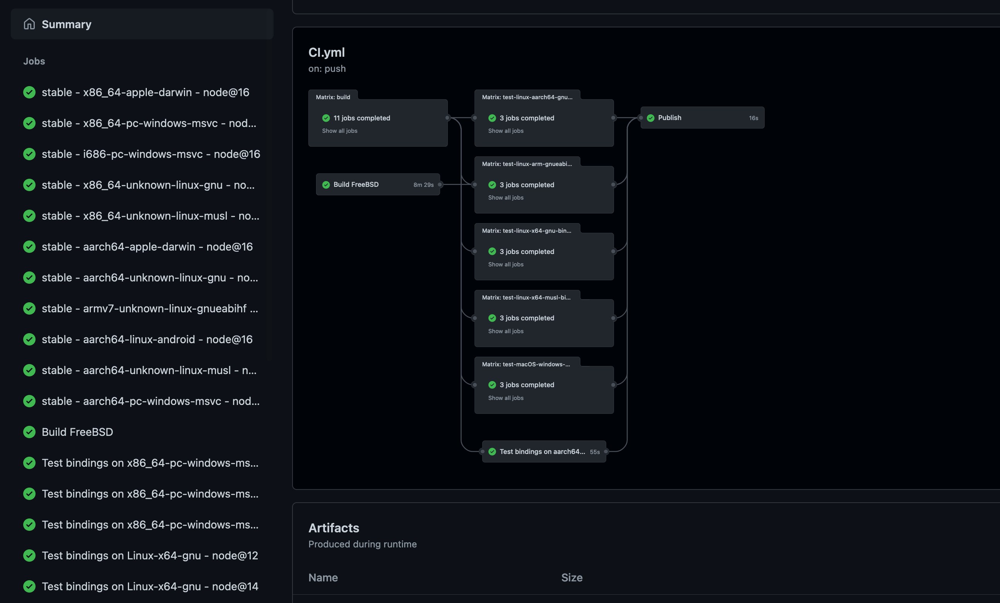

# Um pacote simples

## Criando o `@napi-rs/cool`

Vamos começar pelo `@napi-rs/cli`.

Crie um novo projeto com `napi new`:

```bash {2}
napi new
? Package name: (The name field in your package.json)
```

Vamos dar ao pacote um nome maneiro **@napi-rs/cool**:

::: warning
É recomendado usar um escopo npm para nomear seu pacote. Isso porque
`@napi-rs/cli` irá criar e publicar muitos pacotes por plataforma para você.
Se esses pacotes não estiverem sob um escopo npm, isso pode acionar a
[**_detecção de spam_**](https://stackoverflow.com/a/54135900/5684750) do npm
enquanto você os publica pela primeira vez.
:::

```bash {3}
napi new
? Package name: (The name field in your package.json) @napi-rs/cool
? Dir name: (cool)
```

O próximo passo é escolher o nome do diretório para o seu pacote maneiro, o valor padrão é o sufixo do nome do seu pacote. Vamos apenas pressionar **enter** e usar o valor padrão.

```bash {4}
napi new
? Package name: (The name field in your package.json) @napi-rs/cool
? Dir name: cool
? Choose targets you want to support (Press <space> to select, <a> to toggle all, <i> to invert selection,
and <enter> to proceed)
❯ ◯ aarch64-apple-darwin
  ◯ aarch64-linux-android
  ◯ aarch64-unknown-linux-gnu
  ◯ aarch64-unknown-linux-musl
  ◯ aarch64-pc-windows-msvc
  ◯ armv7-unknown-linux-gnueabihf
  ◉ x86_64-apple-darwin
(Move up and down to reveal more choices)
```

O próximo passo é escolher em quais plataformas você deseja dar suporte. Eu quero todas elas, então pressione **A** para escolher todos os alvos e pressione **enter**.

```bash {8}
napi new
? Package name: (The name field in your package.json) @napi-rs/cool
? Dir name: cool
? Choose targets you want to support aarch64-apple-darwin, aarch64-linux-android, aarch64-unknown-linux-gnu
, aarch64-unknown-linux-musl, aarch64-pc-windows-msvc, armv7-unknown-linux-gnueabihf, x86_64-apple-darwin,
x86_64-pc-windows-msvc, x86_64-unknown-linux-gnu, x86_64-unknown-linux-musl, x86_64-unknown-freebsd, i686-p
c-windows-msvc, armv7-linux-androideabi
? Enable github actions? (Y/n)
```

O próximo passo é escolher se deseja habilitar a configuração do `GitHub CI`. Se o seu projeto estiver hospedado no `GitHub`, então você precisa habilitá-lo. Vamos digitar **Y** e pressionar **enter** aqui:

```bash {9-16}
napi new
? Package name: (The name field in your package.json) @napi-rs/cool
? Dir name: cool
? Choose targets you want to support aarch64-apple-darwin, aarch64-linux-android, aarch64-unknown-linux-gnu
, aarch64-unknown-linux-musl, aarch64-pc-windows-msvc, armv7-unknown-linux-gnueabihf, x86_64-apple-darwin,
x86_64-pc-windows-msvc, x86_64-unknown-linux-gnu, x86_64-unknown-linux-musl, x86_64-unknown-freebsd, i686-p
c-windows-msvc, armv7-linux-androideabi
? Enable github actions? Yes
Writing Cargo.toml
Writing .npmignore
Writing build.rs
Writing package.json
Writing src/lib.rs
Writing .github/workflows/CI.yml
Writing .cargo/config.toml
Writing rustfmt.toml
```

E agora, o `@napi-rs/cli` criou um novo pacote chamado `@napi-rs/cool` dentro do diretório `cool`.

Vamos entrar nele e fazer algumas preparações:

```bash
cd cool
yarn install
```

Estou usando `yarn` para instalar as dependências, você pode substituí-lo pelo seu gerenciador de pacote favorito.

Agora, a estrutura do diretório está assim:

```
tree -a
.
├── .cargo
│   └── config.toml
├── .github
│   └── workflows
│       └── CI.yml
├── .npmignore
├── Cargo.toml
├── build.rs
├── npm
├── package.json
├── rustfmt.toml
└── src
    └── lib.rs
```

Seus códigos nativos estão em `src/lib.rs`. O arquivo `.cargo/config.toml` é usado no `GitHub CI` para compilação cruzada. Em geral, este arquivo não afeta seu desenvolvimento em sua máquina local.
O arquivo `.github/workflows/CI.yml` é o arquivo de configuração para [`GitHub Actions`](https://docs.github.com/en/actions).
O arquivo `build.rs` é necessário para construir um complemento(Addon) nativo para o `Node.js`. Não o exclua ou mova para outro lugar.

Depois que a instalação do `yarn` terminar, você pode executar o comando `build` para construir seu primeiro pacote nativo:

```bash
yarn build
yarn run v1.22.17
$ napi build --platform --release
    Updating crates.io index
  Downloaded proc-macro2 v1.0.34
  Downloaded once_cell v1.9.0
  Downloaded napi v2.0.0-beta.7
  Downloaded 3 crates (129.4 KB) in 2.35s
   Compiling proc-macro2 v1.0.34
   Compiling unicode-xid v0.2.2
   Compiling memchr v2.4.1
   Compiling syn v1.0.82
   Compiling regex-syntax v0.6.25
   Compiling convert_case v0.4.0
   Compiling once_cell v1.9.0
   Compiling napi-build v1.2.0
   Compiling napi-sys v2.1.0
   Compiling napi-rs_cool v0.0.0 (/cool)
   Compiling quote v1.0.10
   Compiling aho-corasick v0.7.18
   Compiling regex v1.5.4
   Compiling napi-derive-backend v1.0.17
   Compiling ctor v0.1.21
   Compiling napi-derive v2.0.0-beta.5
   Compiling napi v2.0.0-beta.7
    Finished release [optimized] target(s) in 37.11s
✨  Done in 37.80s.
```

E agora a estrutura de pastas está assim:

```bash {11-13}
tree -a -I target
.
├── .cargo
│   └── config.toml
├── .github
│   └── workflows
│       └── CI.yml
├── .npmignore
├── Cargo.toml
├── build.rs
├── cool.darwin-x64.node
├── index.d.ts
├── index.js
├── node_modules
├── npm
├── package.json
├── rustfmt.toml
└── src
    └── lib.rs
```

Aqui estão mais três arquivos que o comando `yarn build` gerou para você.

`cool.darwin-x64.node` é o arquivo binário do complemento(Addon) do Node.js, o `index.js` é o arquivo de ligação JavaScript gerado que ajuda a exportar todas as coisas no complemento para o chamador do pacote. E o `index.d.ts` é o arquivo de definição TypeScript gerado.

O comando `new` gerou uma simples função `sum` para você no `src/lib.rs`:

**lib.rs**

```rust {7}
#![deny(clippy::all)]

#[macro_use]
extern crate napi_derive;

#[napi]
fn sum(a: i32, b: i32) -> i32 {
  a + b
}
```

E você pode inspecionar o arquivo `index.d.ts` e ver a função `sum` que foi gerada para você:

**index.d.ts**

```ts {9}
/* eslint-disable */

export class ExternalObject<T> {
  readonly '': {
    readonly '': unique symbol
    [K: symbol]: T
  }
}
export function sum(a: number, b: number): number
```

Vamos criar um arquivo `test.mjs` para testar a função `sum` gerada:

**test.mjs**

```js
import { sum } from './index.js'

console.log('From native', sum(40, 2))
```

Execute isso!

```bash
node test.mjs
From native 42
```

Parabéns! Você criou com sucesso um complemento nativo para o `Node.js`!

## Publique-o!

Infelizmente, você não pode publicar o `@napi-rs/cool`, porque você não tem permissão para publicar pacotes no escopo npm `@napi-rs`.

No entanto, você pode criar seu próprio `escopo npm`: https://docs.npmjs.com/creating-and-publishing-scoped-public-packages.

Assim que você tiver criado seu próprio escopo npm, você pode usar o comando `napi rename` para renomear o projeto recém criado.

```bash {1}
napi rename
? name: name field in package.json
```

Vamos supor que você acabou de criar um escopo npm chamado `jarvis`, você pode digitar `@jarvis/cool` aqui:

```bash {3}
napi rename
? name: name field in package.json @jarvis/cool
? napi name: (cool)
```

Você não precisa alterar o campo `napi name` no `package.json` porque o sufixo do pacote não é alterado. Apenas pressione **Enter** para manter o nome `cool`.

```bash
napi rename
? name: name field in package.json @jarvis/cool
? napi name: cool
? repository: Leave empty to skip
```

E você precisa de um repositório do `GitHub` se quiser publicar um pacote **NAPI-RS**, porque você precisa das `GitHub Actions` para realizar os trabalhos de compilação para você. Basta digitar a URL do seu repositório do GitHub aqui.

```bash {5}
napi rename
? name: name field in package.json @jarvis/cool
? napi name: cool
? repository: Leave empty to skip
? description: Leave empty to skip
```

E o campo `description` no arquivo `package.json`. Deixe-o vazio para pular.

Agora que o nome do seu pacote foi renomeado para `@jarvis/cool`, você finalmente pode publicá-lo.

Então inicie a configuração do `git` e faça o push para o GitHub.

```bash
git init
git remote add origin git@github.com/yourname/cool.git
git add .
git commit -m "Init"
git push
```

::: warning
Para publicar pacotes no `GitHub Actions`, você precisa configurar a variável de ambiente `NPM_TOKEN` no seu repositório do `GitHub`.

No projeto vá em **Settings -> Secrets**, e adicione seu **_NPM_TOKEN_** nele.

:::

Se tudo funcionar corretamente, você verá a seguinte matriz de CI:



Esta é apenas uma matriz de CI de teste, vamos finalmente publicar este pacote:

```bash
npm version patch
git push --follow-tags
```

E a matriz `CI` irá construir e publicar o seu pacote `@jarvis/cool`.
